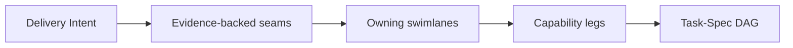

# Seamwise

Seamwise is a seam-first planning system that transforms delivery intent and system evidence into explicit seams, swimlanes, capability legs, dependencies, validation boundaries, and implementation-ready Task-Specs.

> **Status:** pre-implementation foundation. This repository currently contains the canonical target architecture and its project contract. It does not yet contain a working compiler or CLI.

## Why it exists

Agentic engineering systems often jump from a fuzzy outcome to a flat task list. That destroys the architecture, causal order, ownership boundaries, safe parallelism, and proof that made the work legitimate.

Seamwise fills that missing middle:

Seamwise is not task splitting. It is meaning-preserving work lowering.

## Project foundation

- [`docs/seamwise.pdf`](docs/seamwise.pdf) - canonical target implementation blueprint.
- [`docs/project.md`](docs/project.md) - concise project orientation, boundaries, architecture, and implementation sequence.
- [`AGENTS.md`](AGENTS.md) - operating contract for humans and agents working in this repository.

## Intended product

The target design is a model-agnostic intent-to-task compiler with four transformations:

1. `to-seam-map`
2. `to-delivery-plan`
3. `to-task-graph`
4. `to-task-specs`

The first three determine what the work is. The fourth materializes each trustworthy atom as a Task-Spec.

## Current next step

Review and accept the repository foundation before implementation begins. The first implementation phase will extract the existing Task Pack into Seamwise without changing its behavior, then prove parity with its current entry points.
