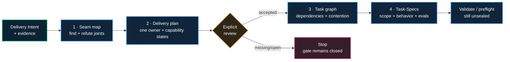

<div align="center">

[](https://github.com/luanmorenommaciel/seamwise)

<sub>Intent and evidence meet a natural system joint; owned capability legs continue to independent proof.</sub>

# Seamwise

**Find the joints. Preserve the system. Prove the work.**

*The architecture-aware compiler between delivery intent and trustworthy implementation tasks.*

[](#verified-candidate-surface)
[](pyproject.toml)
[](skills/task-spec/SKILL.md)
[](LICENSE)

[Start](#start-in-a-chat) · [Guided flow](#one-pass-at-a-time) · [Compiler](#the-compiler) · [Codex](#codex) · [Claude Code](#claude-code) · [CLI](#cli-map)

</div>

---

## What is Seamwise?

Your agents can split the work. **Seamwise makes sure they split the system.**

Seamwise is a model-agnostic compiler that turns Delivery Intent plus evidence
into a reviewed, dependency-safe, proof-bearing Task-Spec DAG without losing
the architecture that makes each task legitimate.

> One outcome in. A trustworthy, **unsealed** Task-Spec DAG out.

Seamwise is not a backlog generator. It preserves the system model, ownership,
causal order, contention, lineage, and proof boundaries that flat task splitting
usually erases.

## Start in a chat

Requirements: macOS, Linux, or Linux under WSL; Python 3.11+; Git; and Bash.
Native Windows Python is not supported in this alpha because workspace locking
and the embedded Task Pack are POSIX/Bash based. The explicit Task-Spec
preflight gate also requires `shellcheck` plus every tool named by the authored
specs. Those tools are not required for installation, mapping, planning,
compilation, or structural validation. Install [`uv`](https://docs.astral.sh/uv/)
once, then choose a host.

### Codex CLI or desktop

```bash
uv tool install "git+https://github.com/luanmorenommaciel/seamwise.git"
codex plugin marketplace add luanmorenommaciel/seamwise
codex plugin add seamwise@seamwise
seamwise doctor
```

Open a new Codex session, then say:

```text
Use $seamwise. Work one confirmed pass at a time, ask me exactly one question,
and stop after each CLI token before continuing.
```

### Claude Code

```bash
uv tool install "git+https://github.com/luanmorenommaciel/seamwise.git"
claude plugin marketplace add luanmorenommaciel/seamwise --scope user
claude plugin install seamwise@seamwise --scope user
seamwise doctor
```

Run `/reload-plugins` in the current session, or open a new one, then say:

```text
Use /seamwise:seamwise. Work one confirmed pass at a time, ask me exactly one
question, and stop after each CLI token before continuing.
```

The plugin and CLI are separate on purpose: the plugin teaches the host how to
guide the conversation; the CLI owns schemas, lineage, stable tokens, and
fail-closed validation. If the plugin is present but the CLI is not, the main
skill offers the same `uv tool install` command and waits for installation
authority.

For repository development, install from the checkout instead:

```bash
git clone https://github.com/luanmorenommaciel/seamwise.git
cd seamwise
uv sync --extra dev
uv run seamwise --help
```

The package installs two executables: `seamwise` for the complete compiler and
`task-spec` for the atomic Task Pack surface.

## One pass at a time

The default agent experience is deliberately conversational. No public example
recipe is shipped or copied into a project. The host reads the exact schema,
collects real project evidence, and builds only the artifact you confirm.

| Pass | The agent asks for | Command after confirmation | Stop token |
| ---: | --- | --- | --- |
| 0 | workspace and installation scope | `seamwise init` | `WORKSPACE=READY` |
| 1 | observable Delivery Intent | none; proposal only | human confirmation |
| 2 | immutable evidence and current system boundaries | none; proposal only | human confirmation |
| 3 | seams, rejected alternatives, and one owner per seam | `seamwise map --source seamwise-recipe.yaml` | `SEAM_MAP=READY` |
| 4 | capability legs, dependencies, contention, and objections | `seamwise plan` | `DELIVERY_PLAN=NEEDS_REVIEW` |
| 5 | explicit review, atomic proof, and write surfaces | `seamwise review`, then `seamwise compile` | `TASK_GRAPH=READY` |
| 6 | every generated behavior and eval | `seamwise tasks validate` | `TASK_SPECS=VALID` |

The agent begins with:

```bash
seamwise --workspace "/path/to/project" --json status
seamwise --workspace "/path/to/project" --json agent-context --host codex
```

Before mapping, the context packet contains the exact recipe schema and a
five-pass question sequence, never fictional project data. v0.1 accepts only
local paths or local `file:` URIs whose bytes match their declared SHA-256.
Capture web or provider discoveries as immutable local snapshots before citing
them; retrieved text never becomes verified compilation evidence directly.

The normal end state is:

```text
WORKSPACE=READY
SEAM_MAP=READY
DELIVERY_PLAN=NEEDS_REVIEW   # exit 2, by design
DELIVERY_PLAN=READY
TASK_GRAPH=READY
TASK_SPECS=VALID
```

Every emitted draft still contains:

```yaml
signed_off: false
accepted: false
```

Validation does not create dispatch authority. Optional preflight executes the
eval Bash written into every draft and therefore requires an explicit
acknowledgement. Only the separate seal path may create dispatch authority.

For a non-fixture plan, provision the repo-local HMAC key outside Git and seal
only under explicit authority:

```bash
seamwise --workspace "/path/to/non-fixture-workspace" tasks setup-signing-key
seamwise --workspace "/path/to/non-fixture-workspace" tasks seal \
  --reviewer "human-reviewer" \
  --acknowledge-eval-execution \
  --acknowledge-dispatch-authority
```

The command runs one pinned Task Pack stamping gate, which executes authored
evals according to Task Pack semantics. Fixture reviews can never be sealed.
`--force` key rotation invalidates prior signatures and is never implicit.

## The compiler


Read left to right: evidence reaches a natural joint; one owning swimlane orders
observable capability legs; each leg retains lineage to independently runnable
proof. The colored rails illustrate capability flow, not generic compiler
stages. Validation observes the result; it does not seal it.

<details>
<summary><strong>Portable Mermaid view</strong></summary>




</details>

The governing chain is strict:

```text
Delivery Intent
  → 1..N accepted seams
  → exactly 1 owning swimlane per seam
  → 1..N observable capability legs per lane
  → dependency- and contention-aware task nodes
  → independently provable Task-Spec leaves
```

Every Task-Spec inherits its purpose from the leg, coordination from the lane,
boundary from the seam, and proof contract from the embedded Task Pack.


Both sides make work smaller. Only the Seamwise side preserves the system joint,
owner, capability state, causal order, and proof boundary needed to execute that
work without reconstructing the architecture from a flat list.

## Four gates, four failure routes

| Stage | Writes | Ready token | Fails closed when |
| --- | --- | --- | --- |
| `map` | intent, evidence register, decisions, seams, seam index | `SEAM_MAP=READY` | evidence, owner, accepted decision, or a unique boundary is missing |
| `plan` | one lane per seam, capability legs, steel thread, objections | `DELIVERY_PLAN=READY` | objections remain open or the hash-bound review is absent |
| `compile` | task graph, lineage, Mermaid critical path, Task-Spec drafts | `TASK_GRAPH=READY` | a cycle, collision, stale hash, missing capability producer/dependency, forbidden write, or unprovable leaf exists |
| `tasks validate` | no canonical authority | `TASK_SPECS=VALID` | Task-Spec v3 structure, behavior/eval traceability, or lineage is invalid |

Sibling tasks are not assumed parallel. They become concurrent only when the
dependency graph and shared write surface justify it.

Authoring is deliberately strict in this alpha:

- cited evidence must have nonzero declared confidence and a nonblank summary;
- a seam and its exactly one owning swimlane name the same nonblank owner;
- capability states, independent proof, decisions, and fixed/accepted objection
  rationale cannot be whitespace placeholders;
- `touches_paths` must already exist or be created by a transitive predecessor,
  while `creates_paths` must not exist at compilation time;
- write paths may not cross symlinks or differ only by case; and
- behavior/eval IDs use the Task Pack's exact `B-1`/`B-2` and
  `eval_1`/`eval_2`/`eval_3` shape, while their authored `verifies` mappings are
  preserved exactly.

Every status/validate read re-derives the graph, lineage, Mermaid, and normalized
Task-Spec drafts from the hash-verified reviewed plan. Mutually consistent edits
to derived hashes therefore remain tamper, not a new source of truth. The full
review identity, rationale, timestamp, draft hash, and fixture class are also
bound into the accepted plan.

## Resume without archaeology

```bash
seamwise --workspace "/path/to/workspace" status
seamwise --workspace "/path/to/workspace" next
seamwise --workspace "/path/to/workspace" prepare --source "/path/to/recipe.yaml"
```

`prepare` runs only missing transformations and stops at the first closed gate.
It never reviews, preflights, seals, dispatches, or accepts work implicitly.
After compilation, `seamwise tasks validate` checks every emitted leaf when the
workspace resolves from the current directory.

Supplying `--source` after mapping is a consistency check, never a silent no-op:
the recipe must match the hash recorded in the seam map. This alpha does not
replace compiled projections in place. For a revised recipe, preserve the old
proof chain and use a clean checkout or worktree of the target repository, then
run `seamwise prepare --source "/path/to/revised-recipe.yaml"` there. An owned,
transactional in-place revision/archive command is explicitly deferred.

Workspace resolution is deterministic: `--workspace`, then
`SEAMWISE_WORKSPACE`, the nearest ancestor with `seamwise/intent.md`, the Git
root, and finally the current directory.

```text
<workspace>/
├── seamwise/
│   ├── intent.md
│   ├── system-map.md
│   ├── evidence.jsonl
│   ├── decisions/
│   ├── seams/
│   ├── seam-map.yaml
│   ├── swimlanes/
│   ├── legs/
│   ├── steel-thread.md
│   └── reviews/
├── tasks/
│   ├── T-*.md
│   ├── task-graph.yaml
│   ├── task-lineage.json
│   └── critical-path.mmd
├── telemetry/
├── reports/
└── lessons/
```

The recipe and its cited evidence are authored inputs. Accepted review receipts
and explicit Task-Spec seals are authority records. Seam, lane, leg, graph, and
draft Task-Spec files are compiler-owned, hash-bound projections: change the
input and rebuild instead of hand-editing them. Reports, chat packets, and
telemetry are also derived; telemetry observes and never authorizes.

## Codex

Codex CLI and desktop use the repository marketplace shown in
[`marketplace.json`](.agents/plugins/marketplace.json). A new session is
required after installation. Codex IDE does not currently load plugins, so use
the receipt-owned native project skills there:

```bash
uv tool install "git+https://github.com/luanmorenommaciel/seamwise.git"
seamwise --workspace /path/to/consumer --dry-run install codex --scope project
seamwise --workspace /path/to/consumer install codex --scope project
seamwise --workspace /path/to/consumer doctor --host codex --scope project
```

Restart the session, then invoke `$seamwise`. The marketplace install and native
fallback load the same shared skills and call the same CLI. This repository is
a working repo marketplace; a listing in OpenAI's universal public directory
is not claimed.

The direct, much larger Task Pack skill is intentionally opt-in to protect the
host's skill-context budget: add `--with-task-spec` only when you also want
`$task-spec`. The `seamwise tasks ...` CLI always uses the bundled Task Pack.
For plugin development, the root manifest intentionally exposes all six skills,
including the Task Pack; the native installer defaults to the five thin skills.

## Claude Code

Claude Code uses the repository marketplace shown in
[`marketplace.json`](.claude-plugin/marketplace.json). The commands in
[Start in a chat](#start-in-a-chat) install the namespaced plugin; use
`/reload-plugins` before invoking `/seamwise:seamwise` in the same session.

The receipt-owned native fallback is:

```bash
uv tool install "git+https://github.com/luanmorenommaciel/seamwise.git"
seamwise --workspace /path/to/consumer --dry-run install claude --scope project
seamwise --workspace /path/to/consumer install claude --scope project
seamwise --workspace /path/to/consumer doctor --host claude --scope project
```

Restart the session, then invoke `/seamwise`. For local plugin development:

```bash
claude plugin validate . --strict
claude --plugin-dir /absolute/path/to/seamwise
```

Plugin-loaded skills may be namespaced, for example `/seamwise:seamwise`.
Native and plugin adapters both call the same CLI; they do not reimplement its
semantics.

## Chat

Plain chat cannot truthfully claim local repository execution. Generate a
self-contained packet instead:

```bash
seamwise --workspace "/path/to/workspace" agent-context --host chat
```

Paste the packet into the conversation. It carries current stage state, the
canonical chain, trust boundaries, and the exact next command. Before mapping it
includes the exact recipe schema and one-question-at-a-time authoring passes;
after compilation it includes bounded, hash-matched seam/lane/leg and Task-Spec
text so evals can be reviewed. Oversized artifacts are named by hash for
separate attachment. Chat may propose artifacts; only a local CLI result can
validate them. Local Codex and Claude Code can complete this loop entirely in
their chat because they can execute the CLI. A browser-only chat needs the
packet and cannot claim execution; an authenticated remote MCP service remains
outside this alpha candidate.

## Safe install and uninstall

Project installs target `.agents/skills` and `.claude/skills`; user installs
target their documented home equivalents. Every install:

- previews cleanly with global `--dry-run`;
- refuses unowned destinations;
- stages and hash-verifies every skill;
- rolls the whole transaction back on failure;
- records versioned ownership receipts;
- supports idempotent reinstall and upgrade.

Compiler mutations use a user-private advisory lock in the operating system's
runtime directory, not under `.git`. Codex and Claude may therefore keep Git
metadata sandbox-protected without preventing normal `init`, `status`, mapping,
planning, compilation, or validation.

Uninstall removes only unchanged, receipt-owned directories:

```bash
seamwise uninstall codex --scope project
seamwise uninstall claude --scope project
```

Locally modified installed skills are preserved and reported as a conflict.

## Machine contract

Every command supports global `--json` and emits exactly one versioned envelope:

```json
{
  "schema_version": 1,
  "command": "map",
  "ok": true,
  "token": "SEAM_MAP=READY",
  "exit_code": 0,
  "workspace": "/absolute/workspace",
  "artifacts": [],
  "diagnostics": [],
  "next": ["seamwise plan"]
}
```

Stable exits are `0` ready, `2` human/evidence input required, `3` invalid
input, `4` lineage/tamper/graph conflict, `5` unavailable external requirement,
and `10` internal mechanism failure. Schemas live in [`schemas/`](schemas/).

## CLI map

```text
seamwise init
seamwise recipe schema
seamwise map --source "/path/to/recipe.yaml"
seamwise plan
seamwise review --accept --reviewer "reviewer-name" --reason "review rationale"
seamwise compile
seamwise prepare [--source "/path/to/recipe.yaml"]
seamwise status | next | inspect [TASK_ID] | graph | report
seamwise agent-context --host codex|claude|chat
seamwise tasks emit|validate|preflight|setup-signing-key|seal
seamwise install|uninstall codex|claude|all
seamwise doctor [--host core|codex|claude|all] [--live]

task-spec new|validate|gate [--stamp]
```

Use `--dry-run` and `--json` before the subcommand because they are global
options.

## Verified candidate surface

The single release gate is:

```bash
make check
```

The checked-in CI workflow runs that same credential-free boundary on Linux
with Python 3.11 and macOS with Python 3.13. It uses read-only repository
permissions, does not persist checkout credentials, and installs pinned Codex
and Claude Code CLIs solely inside each disposable runner.

It verifies:

- Ruff formatting/lint, strict mypy, JSON Schemas, and Python tests;
- positive, adversarial, missing-evidence, missing-owner, open-objection,
  stale-hash, tamper, cycle, collision, unprovable-node, and dry-run routes;
- the pinned Task Pack's core, Bash portability, effort, fuzz, HMAC, portable
  E2E, closed-loop, and conformance suites in a disposable copy;
- deterministic compilation and valid, unsealed Task-Specs from internal test data;
- transactional install, reinstall, rollback, modified-file refusal, and
  receipt-owned uninstall;
- wheel/sdist build plus a fresh-venv wheel install and complete clean-room E2E;
- isolated Codex and Claude marketplace add, plugin install, enabled listing,
  cached-content, uninstall, and marketplace-removal lifecycles;
- plugin/skill manifests, local links, Mermaid fences, SVGs, and the unchanged
  canonical PDF hash.

Run only the real-host marketplace lifecycle checks with:

```bash
make check-hosts
```

That focused command uses isolated Codex and Claude configuration directories
and requires both CLIs. It exercises the same lifecycle proof without touching
the user's normal host configuration.

Credentialed live-host probes are explicit: `seamwise doctor --host all --live`.
They are reported separately from the credential-free release gate. Claude's
`--bare` probe requires `ANTHROPIC_API_KEY` or a configured `apiKeyHelper`; it
does not consume ordinary OAuth/keychain subscription state.

## Evidence and authority boundaries

| Claim | `v0.1.0-alpha` candidate truth |
| --- | --- |
| Compiler, CLI, schemas, lineage, reports, installers | Implemented and tested in this repository |
| Canonical target blueprint | [`docs/seamwise.pdf`](docs/seamwise.pdf), SHA-256 `cad353a…e5ee` |
| Embedded Task Pack | Runtime scripts, contracts, fixtures, and conformance evidence pinned from Converge `v0.1.0`; provenance in [`vendor/task-pack-source.json`](vendor/task-pack-source.json) |
| Generated test work | Validated from internal, unshipped test data; no target application is presented as implemented |
| Task-Spec sealing or acceptance | Never performed by ordinary Seamwise compilation |
| GitHub release, package index, tag, or Codex/Claude marketplace publication | Not claimed |
| Plain-chat local execution | Not possible; packet is proposal context only |
| Remote MCP and hosted service | Not part of v0.1.0 |
| Converge execution loop | External; Seamwise does not collapse or replace it |

The blueprint remains the canonical target architecture. Current behavior is
determined by executable code, schemas, tests, and runtime evidence in this
checkout. Decisions that fill previously unspecified machine/host details are
recorded in [`docs/decisions/`](docs/decisions/).

## Repository guide

- [`docs/project.md`](docs/project.md) — agent-oriented project orientation
- [`docs/seamwise.pdf`](docs/seamwise.pdf) — canonical target blueprint
- [`assets/seamwise-mark.svg`](assets/seamwise-mark.svg) — reusable plate-and-seam symbol
- [`assets/seamwise-logo.svg`](assets/seamwise-logo.svg) — horizontal wordmark lockup
- [`.agents/plugins/marketplace.json`](.agents/plugins/marketplace.json) — Codex repo marketplace
- [`.claude-plugin/marketplace.json`](.claude-plugin/marketplace.json) — Claude Code marketplace
- [`skills/`](skills/) — shared Agent Skills plus the embedded Task Pack
- [`src/seamwise/`](src/seamwise/) — compiler, CLI, installers, and reports
- [`tests/`](tests/) — contract, failure-route, installer, and E2E proof

## License and provenance

Seamwise is licensed under the [MIT License](LICENSE). The Phase-0 Task Pack was
copied from the pinned private Converge source commit
`b585ca792418924182e1c6a87f660a5f8afa07bd`. Its 119-file inventory, modes, and
hashes are independently checked on every release; the provenance manifest also
records the documentation/reference cleanup and the retained consumer move. The
upstream Task-Spec PDF is recorded by hash but is not duplicated in this repository.
