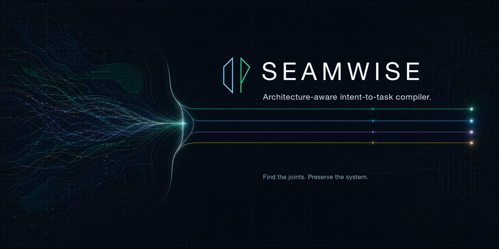
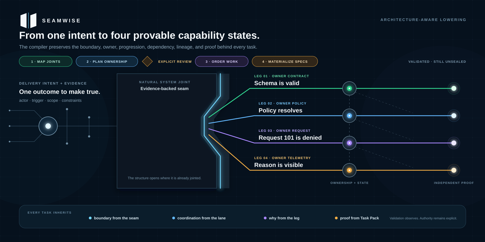
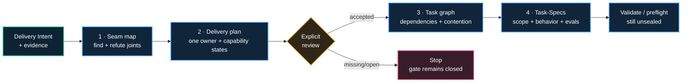
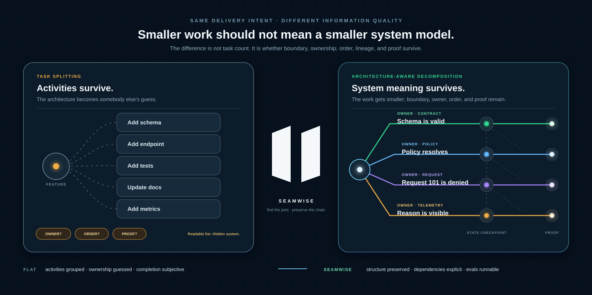

<div align="center">

[](https://github.com/luanmorenommaciel/seamwise)

# Seamwise

**Find the joints. Preserve the system. Prove the work.**

*The architecture-aware compiler between delivery intent and trustworthy implementation tasks.*

[](#verified-candidate-surface)
[](pyproject.toml)
[](docs/task-spec-v0.1.pdf)
[](LICENSE)

[Install](#install) · [Prove it](#prove-it-in-one-workspace) · [Compiler](#the-compiler) · [Codex](#codex) · [Claude Code](#claude-code) · [CLI](#cli-map)

</div>

---

## What is Seamwise?

Your agents can split the work. **Seamwise makes sure they split the system.**

Seamwise is a model-agnostic compiler that turns Delivery Intent plus evidence
into a reviewed, dependency-safe, proof-bearing Task-Spec DAG without losing
the architecture that makes each task legitimate.

> One outcome in. A trustworthy, **unsealed** Task-Spec DAG out.

Seamwise is not a backlog generator. It preserves the system model, ownership,
causal order, contention, lineage, and proof boundaries that flat task splitting
usually erases.

## Install

Requirements: macOS, Linux, or Linux under WSL; Python 3.11+; Git; and Bash.
Native Windows Python is not supported in this alpha because workspace locking
and the embedded Task Pack are POSIX/Bash based. The explicit Task-Spec
preflight gate also requires `shellcheck` plus every tool named by the authored
specs. The included rate-limiting proof names `pytest`; put both `shellcheck`
and a `pytest` executable on `PATH` before running its preflight. Neither is
required for installation, mapping, planning, compilation, or validation.

With [`uv`](https://docs.astral.sh/uv/):

```bash
git clone https://github.com/luanmorenommaciel/seamwise.git
cd seamwise
uv tool install .
seamwise doctor
```

For repository development:

```bash
git clone https://github.com/luanmorenommaciel/seamwise.git
cd seamwise
uv sync --extra dev
uv run seamwise --help
```

The package installs two executables: `seamwise` for the complete compiler and
`task-spec` for the atomic Task Pack surface.

## Author the first recipe without guessing

From the target repository:

```bash
seamwise init
seamwise recipe schema
seamwise recipe example --output seamwise-recipe.yaml
```

The example command is non-clobbering. It also materializes the exact
SHA-256-pinned blueprint at `seamwise-evidence/seamwise.pdf`, so its source is
resolvable offline even from a wheel-only install. Replace every fixture fact
with current project evidence before mapping; the example is not project truth.
v0.1 accepts only local paths or local `file:` URIs whose bytes match the
declared SHA-256. Capture HTTP, provider, Exa, Tavily, or Firecrawl discoveries
as immutable local snapshots before citing them; remote text is never promoted
to verified compilation evidence directly.

## Prove it in one workspace

The included rate-limiting case follows the canonical steel thread in the
blueprint: schema → effective policy → request 101 enforcement → visible reason
and decision telemetry.

```bash
demo_workspace="$(mktemp -d)"
git -C "$demo_workspace" init -q

seamwise --workspace "$demo_workspace" init
seamwise --workspace "$demo_workspace" map \
  --source examples/rate-limiting/recipe.yaml

# This intentionally exits 2: a plan cannot approve itself.
seamwise --workspace "$demo_workspace" plan

# A real reviewer makes the explicit transition. --fixture is test evidence only.
seamwise --workspace "$demo_workspace" review --accept \
  --reviewer example-reviewer \
  --reason "Accept the documented proving fixture" \
  --fixture

seamwise --workspace "$demo_workspace" compile
seamwise --workspace "$demo_workspace" tasks validate
seamwise --workspace "$demo_workspace" tasks preflight \
  --acknowledge-eval-execution
seamwise --workspace "$demo_workspace" graph
```

Expected gate sequence:

```text
WORKSPACE=READY
SEAM_MAP=READY
DELIVERY_PLAN=NEEDS_REVIEW   # exit 2, by design
DELIVERY_PLAN=READY
TASK_GRAPH=READY
TASK_SPECS=VALID
TASK_SPECS=PREFLIGHT_READY
```

Every emitted draft still contains:

```yaml
signed_off: false
accepted: false
```

Validation and preflight do not create dispatch authority. Only the explicit
seal path may do so. Preflight executes the eval Bash written into every draft;
the acknowledgement is intentionally required.

For a non-fixture plan, provision the repo-local HMAC key outside Git and seal
only under explicit authority:

```bash
seamwise --workspace "/path/to/non-fixture-workspace" tasks setup-signing-key
seamwise --workspace "/path/to/non-fixture-workspace" tasks seal \
  --reviewer "human-reviewer" \
  --acknowledge-eval-execution \
  --acknowledge-dispatch-authority
```

The command runs one pinned Task Pack stamping gate, which executes authored
evals according to Task Pack semantics. Fixture reviews can never be sealed.
`--force` key rotation invalidates prior signatures and is never implicit.

## The compiler



<details>
<summary><strong>Portable Mermaid view</strong></summary>




</details>

The governing chain is strict:

```text
Delivery Intent
  → 1..N accepted seams
  → exactly 1 owning swimlane per seam
  → 1..N observable capability legs per lane
  → dependency- and contention-aware task nodes
  → independently provable Task-Spec leaves
```

Every Task-Spec inherits its purpose from the leg, coordination from the lane,
boundary from the seam, and proof contract from the embedded Task Pack.



## Four gates, four failure routes

| Stage | Writes | Ready token | Fails closed when |
| --- | --- | --- | --- |
| `map` | intent, evidence register, decisions, seams, seam index | `SEAM_MAP=READY` | evidence, owner, accepted decision, or a unique boundary is missing |
| `plan` | one lane per seam, capability legs, steel thread, objections | `DELIVERY_PLAN=READY` | objections remain open or the hash-bound review is absent |
| `compile` | task graph, lineage, Mermaid critical path, Task-Spec drafts | `TASK_GRAPH=READY` | a cycle, collision, stale hash, missing capability producer/dependency, forbidden write, or unprovable leaf exists |
| `tasks validate` | no canonical authority | `TASK_SPECS=VALID` | Task-Spec v3 structure, behavior/eval traceability, or lineage is invalid |

Sibling tasks are not assumed parallel. They become concurrent only when the
dependency graph and shared write surface justify it.

Authoring is deliberately strict in this alpha:

- cited evidence must have nonzero declared confidence and a nonblank summary;
- a seam and its exactly one owning swimlane name the same nonblank owner;
- capability states, independent proof, decisions, and fixed/accepted objection
  rationale cannot be whitespace placeholders;
- `touches_paths` must already exist or be created by a transitive predecessor,
  while `creates_paths` must not exist at compilation time;
- write paths may not cross symlinks or differ only by case; and
- behavior/eval IDs use the Task Pack's exact `B-1`/`B-2` and
  `eval_1`/`eval_2`/`eval_3` shape, while their authored `verifies` mappings are
  preserved exactly.

Every status/validate read re-derives the graph, lineage, Mermaid, and normalized
Task-Spec drafts from the hash-verified reviewed plan. Mutually consistent edits
to derived hashes therefore remain tamper, not a new source of truth. The full
review identity, rationale, timestamp, draft hash, and fixture class are also
bound into the accepted plan.

## Resume without archaeology

```bash
seamwise --workspace "/path/to/workspace" status
seamwise --workspace "/path/to/workspace" next
seamwise --workspace "/path/to/workspace" prepare --source "/path/to/recipe.yaml"
```

`prepare` runs only missing transformations and stops at the first closed gate.
It never reviews, preflights, seals, dispatches, or accepts work implicitly.
After compilation, `seamwise tasks validate` checks every emitted leaf when the
workspace resolves from the current directory.

Supplying `--source` after mapping is a consistency check, never a silent no-op:
the recipe must match the hash recorded in the seam map. This alpha does not
replace compiled projections in place. For a revised recipe, preserve the old
proof chain and use a clean checkout or worktree of the target repository, then
run `seamwise prepare --source "/path/to/revised-recipe.yaml"` there. An owned,
transactional in-place revision/archive command is explicitly deferred.

Workspace resolution is deterministic: `--workspace`, then
`SEAMWISE_WORKSPACE`, the nearest ancestor with `seamwise/intent.md`, the Git
root, and finally the current directory.

```text
<workspace>/
├── seamwise/
│   ├── intent.md
│   ├── system-map.md
│   ├── evidence.jsonl
│   ├── decisions/
│   ├── seams/
│   ├── seam-map.yaml
│   ├── swimlanes/
│   ├── legs/
│   ├── steel-thread.md
│   └── reviews/
├── tasks/
│   ├── T-*.md
│   ├── task-graph.yaml
│   ├── task-lineage.json
│   └── critical-path.mmd
├── telemetry/
├── reports/
└── lessons/
```

The recipe and its cited evidence are authored inputs. Accepted review receipts
and explicit Task-Spec seals are authority records. Seam, lane, leg, graph, and
draft Task-Spec files are compiler-owned, hash-bound projections: change the
input and rebuild instead of hand-editing them. Reports, chat packets, and
telemetry are also derived; telemetry observes and never authorizes.

## Codex

Install the native project skills after previewing every destination:

```bash
seamwise --workspace /path/to/consumer --dry-run install codex --scope project
seamwise --workspace /path/to/consumer install codex --scope project
seamwise --workspace /path/to/consumer doctor --host codex --scope project
```

Restart the session, then invoke `$seamwise`. Codex IDE uses the same standalone
skills under `.agents/skills/`. The root [Codex plugin manifest](.codex-plugin/plugin.json)
is validated and ready for a supported plugin/marketplace workflow, but this
repository does not claim that a marketplace listing has been published.

The direct, much larger Task Pack skill is intentionally opt-in to protect the
host's skill-context budget: add `--with-task-spec` only when you also want
`$task-spec`. The `seamwise tasks ...` CLI always uses the bundled Task Pack.
For plugin development, the root manifest intentionally exposes all six skills,
including the Task Pack; the native installer defaults to the five thin skills.

## Claude Code

```bash
seamwise --workspace /path/to/consumer --dry-run install claude --scope project
seamwise --workspace /path/to/consumer install claude --scope project
seamwise --workspace /path/to/consumer doctor --host claude --scope project
```

Restart the session, then invoke `/seamwise`. For local plugin development:

```bash
claude plugin validate . --strict
claude --plugin-dir /absolute/path/to/seamwise
```

Plugin-loaded skills may be namespaced, for example `/seamwise:seamwise`.
Native and plugin adapters both call the same CLI; they do not reimplement its
semantics.

## Chat

Plain chat cannot truthfully claim local repository execution. Generate a
self-contained packet instead:

```bash
seamwise --workspace "/path/to/workspace" agent-context --host chat
```

Paste the packet into the conversation. It carries current stage state, the
canonical chain, trust boundaries, and the exact next command. Before mapping it
includes the exact recipe schema and editable example; after compilation it
includes bounded, hash-matched seam/lane/leg and Task-Spec text so evals can be
reviewed. Oversized artifacts are named by hash for separate attachment. Chat
may propose artifacts; only a local CLI result can validate them. An
authenticated remote MCP service is deliberately outside this alpha candidate.

## Safe install and uninstall

Project installs target `.agents/skills` and `.claude/skills`; user installs
target their documented home equivalents. Every install:

- previews cleanly with global `--dry-run`;
- refuses unowned destinations;
- stages and hash-verifies every skill;
- rolls the whole transaction back on failure;
- records versioned ownership receipts;
- supports idempotent reinstall and upgrade.

Uninstall removes only unchanged, receipt-owned directories:

```bash
seamwise uninstall codex --scope project
seamwise uninstall claude --scope project
```

Locally modified installed skills are preserved and reported as a conflict.

## Machine contract

Every command supports global `--json` and emits exactly one versioned envelope:

```json
{
  "schema_version": 1,
  "command": "map",
  "ok": true,
  "token": "SEAM_MAP=READY",
  "exit_code": 0,
  "workspace": "/absolute/workspace",
  "artifacts": [],
  "diagnostics": [],
  "next": ["seamwise plan"]
}
```

Stable exits are `0` ready, `2` human/evidence input required, `3` invalid
input, `4` lineage/tamper/graph conflict, `5` unavailable external requirement,
and `10` internal mechanism failure. Schemas live in [`schemas/`](schemas/).

## CLI map

```text
seamwise init
seamwise recipe schema | recipe example [--output "/path/to/recipe.yaml"]
seamwise map --source "/path/to/recipe.yaml"
seamwise plan
seamwise review --accept --reviewer "reviewer-name" --reason "review rationale"
seamwise compile
seamwise prepare [--source "/path/to/recipe.yaml"]
seamwise status | next | inspect [TASK_ID] | graph | report
seamwise agent-context --host codex|claude|chat
seamwise tasks emit|validate|preflight|setup-signing-key|seal
seamwise install|uninstall codex|claude|all
seamwise doctor [--host core|codex|claude|all] [--live]

task-spec new|validate|gate [--stamp]
```

Use `--dry-run` and `--json` before the subcommand because they are global
options.

## Verified candidate surface

The single release gate is:

```bash
make check
```

The checked-in CI workflow runs that same credential-free boundary on Linux
with Python 3.11 and macOS with Python 3.13. It uses read-only repository
permissions, does not persist checkout credentials, and keeps hosted-service or
marketplace checks outside the green signal.

It verifies:

- Ruff formatting/lint, strict mypy, JSON Schemas, and Python tests;
- positive, adversarial, missing-evidence, missing-owner, open-objection,
  stale-hash, tamper, cycle, collision, unprovable-node, and dry-run routes;
- the pinned Task Pack's core, Bash portability, effort, fuzz, HMAC, portable
  E2E, closed-loop, and conformance suites in a disposable copy;
- deterministic compilation and four valid, unsealed rate-limiting Task-Specs;
- transactional install, reinstall, rollback, modified-file refusal, and
  receipt-owned uninstall;
- wheel/sdist build plus a fresh-venv wheel install and complete clean-room E2E;
- plugin/skill manifests, local links, Mermaid fences, SVGs, and the unchanged
  canonical PDF hash.

Credentialed live-host probes are explicit: `seamwise doctor --host all --live`.
They are reported separately from the credential-free release gate. Claude's
`--bare` probe requires `ANTHROPIC_API_KEY` or a configured `apiKeyHelper`; it
does not consume ordinary OAuth/keychain subscription state.

## Evidence and authority boundaries

| Claim | `v0.1.0-alpha` candidate truth |
| --- | --- |
| Compiler, CLI, schemas, lineage, reports, installers | Implemented and tested in this repository |
| Canonical target blueprint | [`docs/seamwise.pdf`](docs/seamwise.pdf), SHA-256 `cad353a…e5ee` |
| Embedded Task Pack | Byte/mode-pinned from Converge `v0.1.0`; provenance in [`vendor/task-pack-source.json`](vendor/task-pack-source.json) |
| Generated rate-limit work | Validated proving fixture; the fictional target application is not implemented |
| Task-Spec sealing or acceptance | Never performed by ordinary Seamwise compilation |
| GitHub release, package index, tag, or Codex/Claude marketplace publication | Not claimed |
| Plain-chat local execution | Not possible; packet is proposal context only |
| Remote MCP and hosted service | Not part of v0.1.0 |
| Converge execution loop | External; Seamwise does not collapse or replace it |

The blueprint remains the canonical target architecture. Current behavior is
determined by executable code, schemas, tests, and runtime evidence in this
checkout. Decisions that fill previously unspecified machine/host details are
recorded in [`docs/decisions/`](docs/decisions/).

## Repository guide

- [`PLAN.md`](PLAN.md) — concise end-to-end build and sign-off plan
- [`docs/project.md`](docs/project.md) — agent-oriented project orientation
- [`docs/seamwise.pdf`](docs/seamwise.pdf) — canonical target blueprint
- [`examples/rate-limiting/`](examples/rate-limiting/) — complete proving recipe
- [`skills/`](skills/) — shared Agent Skills plus the embedded Task Pack
- [`src/seamwise/`](src/seamwise/) — compiler, CLI, installers, and reports
- [`tests/`](tests/) — contract, failure-route, installer, and E2E proof

## License and provenance

Seamwise is licensed under the [MIT License](LICENSE). The Phase-0 Task Pack was
imported unchanged from the pinned private Converge source commit
`b585ca792418924182e1c6a87f660a5f8afa07bd`; its 125-file inventory, modes, and
hashes are independently checked on every release.
