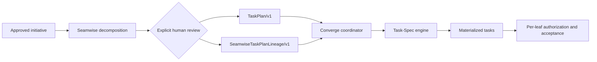

# Seamwise

<p align="center">
  
</p>

<p align="center">
  <a href="https://github.com/luanmorenommaciel/seamwise/releases"></a>
  
  
  <a href="LICENSE"></a>
</p>

> One approved initiative in. One reviewed `TaskPlan/v1` and digest-bound
> lineage out. No task materialization and no dispatch authority.

Seamwise answers one question:

**How should this initiative be sliced along real system seams?**

It maps evidence-backed responsibility boundaries, creates one owning swimlane
per seam, lowers work into observable capability legs, proves dependency and
contention ordering, stops for explicit human review, and projects the reviewed
result into a portable TaskPlan.

Seamwise does not import, vendor, invoke, or reimplement Task-Spec. It does not
write Task-Spec Markdown, authorize dispatch, execute work, or accept delivery.

## Authority boundary



| Product | Owns | Does not own |
|---|---|---|
| Seamwise | evidence-backed decomposition, seams, swimlanes, capability legs, topology, human plan review, TaskPlan projection | Task-Spec validation, materialization, dispatch, execution, acceptance |
| Task-Spec | TaskPlan validation, task materialization, per-leaf authorization, handoff, evaluation, acceptance | initiative discovery or decomposition |
| Converge | engine negotiation, sequencing, runtime binding, settlement, composition receipts | either engine's internal authority |

The invariant is:

> **Seamwise decomposes. Task-Spec contracts. Converge coordinates.**

## Install

```bash
uv tool install "git+https://github.com/luanmorenommaciel/seamwise.git@v0.2.0"
seamwise --version
seamwise --json doctor --host core
```

Core Seamwise requires Python 3.11 or newer and Git. Task-Spec is deliberately
not a Seamwise runtime dependency. A composed caller installs and negotiates
the two engines independently.

Inspect the exact machine boundary:

```bash
seamwise --json capabilities
```

The returned `SeamwiseCapabilities/v1` advertises the engine version,
`TaskPlan/v1`, `SeamwiseTaskPlanLineage/v1`, and the supported coordinator
commands. It also declares `materializes_tasks: false` and
`dispatch_authority: false`.

## First successful journey

Initialize a repository workspace and inspect the recipe schema:

```bash
seamwise --workspace "/path/to/project" init
seamwise --workspace "/path/to/project" recipe schema
```

Author `seamwise-recipe.yaml`, then run each authority boundary explicitly:

```bash
seamwise --workspace "/path/to/project" map --source seamwise-recipe.yaml
seamwise --workspace "/path/to/project" plan
seamwise --workspace "/path/to/project" review \
  --accept \
  --reviewer "human-name" \
  --reason "The seams, ownership, ordering, and proof boundaries are acceptable."
seamwise --workspace "/path/to/project" compile
seamwise --workspace "/path/to/project" status
```

`plan` stops at `DELIVERY_PLAN=NEEDS_REVIEW`. `compile` refuses to cross that
boundary without a current review receipt bound to the exact delivery-plan
digest.

Successful compilation writes exactly two boundary artifacts:

```text
seamwise/
├── task-plan.json
└── task-plan-lineage.json
```

- `task-plan.json` is the reviewed `TaskPlan/v1` input for Task-Spec.
- `task-plan-lineage.json` binds the intent, review digest, TaskPlan digest, and
  every unit ID to its seam, swimlane, capability leg, and source digest.

Compilation is atomic and deterministic. A rerun produces identical bytes.
Coordinated tampering with both files still fails because status rebuilds the
expected projections from the reviewed canonical inputs.

To check interoperability manually without materializing tasks:

```bash
taskspec --json plan --manifest seamwise/task-plan.json
```

Task-Spec validation remains Task-Spec's authority. A caller invokes
`taskspec batch` later and must retain `dispatch_authorized: false` until every
leaf passes `taskspec gate --stamp`.

## Chat interface

Install the five focused Seamwise skills for Codex, Claude Code, or both:

```bash
seamwise install codex --scope project
seamwise install claude --scope project
seamwise install all --scope project
```

Start a new host session after installation. A safe first prompt is:

```text
Use $seamwise to decompose this approved initiative one confirmed pass at a
time. Ask one concise unanswered question, show each proposed artifact, and
wait for my confirmation before running the next Seamwise command.
```

Export a bounded, verified packet for a chat interface with:

```bash
seamwise --workspace "/path/to/project" --json agent-context --host chat
```

Chat output remains a proposal. It cannot review a plan, materialize a task,
or create Task-Spec authority.

## CLI

```text
seamwise init
seamwise recipe schema
seamwise capabilities
seamwise map --source <recipe.yaml>
seamwise plan
seamwise review --accept --reviewer <name> --reason <reason>
seamwise compile
seamwise prepare --source <recipe.yaml>
seamwise status
seamwise next
seamwise inspect [TASK_ID]
seamwise graph
seamwise report --format html|json
seamwise agent-context --host codex|claude|chat
seamwise install codex|claude|all --scope project|user
seamwise uninstall codex|claude|all --scope project|user
seamwise doctor --host core|codex|claude|all
```

`prepare` automates only already-authorized transformations and always stops at
the review boundary. It never reviews or compiles implicitly.

Every command in JSON mode returns exactly one `SeamwiseCLIResult/v1` object:

```json
{
  "contract": "SeamwiseCLIResult/v1",
  "engine_version": "0.2.0",
  "schema_version": 1,
  "command": "status",
  "ok": true,
  "token": "STATUS=READY",
  "exit_code": 0,
  "workspace": "/path/to/project",
  "artifacts": [],
  "diagnostics": [],
  "next": [
    "Pass seamwise/task-plan.json and seamwise/task-plan-lineage.json to the composition coordinator."
  ],
  "data": {
    "reviewed": true,
    "task_graph": true,
    "task_plan": true,
    "task_plan_lineage": true,
    "units": 4,
    "task_specs": 0,
    "materialization_receipt": false,
    "dispatch_authorized": false
  }
}
```

| Exit | Meaning |
|---:|---|
| 0 | operation succeeded or reached its intended boundary |
| 2 | evidence, ownership, decision, or review input is required |
| 3 | command or authored contract is invalid |
| 4 | integrity, concurrency, or topology conflict |
| 5 | required host runtime is unavailable |
| 10 | internal mechanism failure |

## Security and recovery

- Review receipts become stale whenever the delivery plan changes.
- Compile writes the TaskPlan and lineage in one lock-protected transaction.
- Status regenerates both expected projections; altered, partial, additional,
  or stale boundary artifacts fail closed.
- Repository paths are canonical and checked against traversal, case, glob,
  collision, and symlink escape.
- Reports and chat packets explain verified state but create no authority.
- Seamwise never receives Task-Spec credentials or signing keys.

## Development and release proof

```bash
uv sync --extra dev --locked
make check
```

The release gate runs formatting, linting, strict mypy, deterministic and
adversarial tests, documentation checks, wheel inspection, a clean-room wheel
lifecycle, independent Task-Spec `TaskPlan/v1` validation, host-plugin tests,
doctor, and Git whitespace checks.

## Documentation

- [Changelog](CHANGELOG.md)
- [Contributing instructions](AGENTS.md)

Executable code, schemas, tests, built packages, and release evidence define
current behavior.

## Migration from 0.1

Version `0.2.0` removes the bundled Task Pack, the `task-spec` console
script, `seamwise tasks ...`, direct Task-Spec skill installation, and
Task-Spec materialization from `seamwise compile`.

Install Task-Spec separately. Existing Seamwise plans can be reviewed and
recompiled into the two new boundary artifacts. Let Converge or another caller
invoke Task-Spec; do not copy the removed engine or restore local gate logic.

## License

[MIT](LICENSE). Task-Spec and Converge are separate products with independent
repositories, releases, and conformance evidence.
