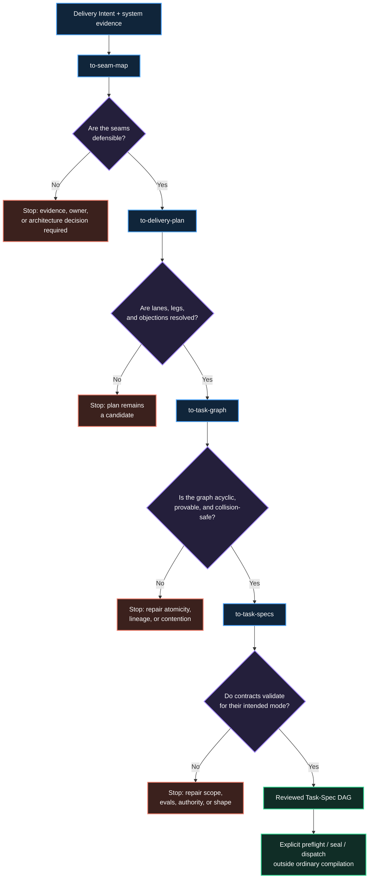
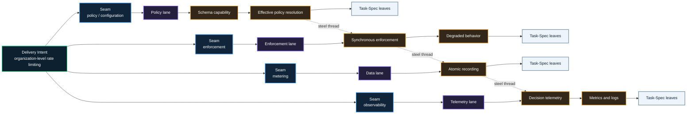
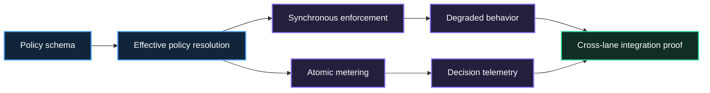
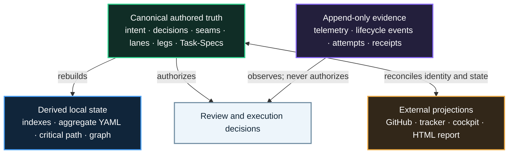
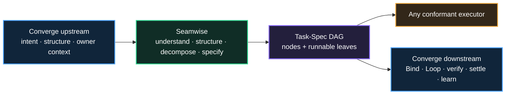
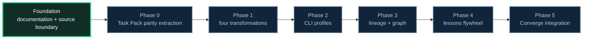

# Seamwise

## Your agents can split the work. Seamwise makes sure they split the system

Seamwise is an architecture-aware, model-agnostic intent-to-task compiler. Its
target design turns Delivery Intent plus system evidence into explicit seams,
owning swimlanes, observable capability legs, dependency-safe work, and
implementation-ready Task-Specs.

**Find the joints. Form the lanes. Stage the capability. Prove the work.**

[](#project-status)
[](docs/seamwise.pdf)
[](#project-status)


> One outcome in. A trustworthy Task-Spec DAG out.

Seamwise does not make a backlog look more organized. It preserves the system
model, causal order, ownership boundaries, safe parallelism, lineage, and proof
that ordinary decomposition tends to erase.

## Project status

> [!IMPORTANT]
> **Seamwise is currently an inception-stage documentation foundation.** This
> repository contains the canonical target implementation blueprint and its
> project contract. It does **not** yet contain a working compiler, package,
> CLI, runtime, generated graph, or proven integration.

The architecture in this README is **proposed target behavior**, grounded in
[`docs/seamwise.pdf`](docs/seamwise.pdf). Current repository behavior is limited
to the documentation and operating contract visible in this checkout.

| Claim | Current state |
| --- | --- |
| Canonical target architecture | Documented in [`docs/seamwise.pdf`](docs/seamwise.pdf) |
| Repository orientation | Documented in [`docs/project.md`](docs/project.md) |
| Agent contribution contract | Documented in [`AGENTS.md`](AGENTS.md) |
| Seamwise compiler and CLI | Not implemented |
| Task Pack extraction | Planned Phase 0 work |
| Runtime or integration proof | Not available |

## The problem

Agentic engineering systems often jump directly from a fuzzy outcome to a flat
list of tasks:

- add a schema;
- add an endpoint;
- add tests;
- update docs;
- add metrics.

Each item may be understandable on its own while the collection is
architecturally incoherent. The list does not say where the real system joints
are, who owns each boundary, what must become true first, which work may safely
run together, or what proves the complete outcome.


> Same delivery intent. On the left, the architecture is implicit. On the
> right, structure, coordination, progression, dependencies, and proof remain
> visible.

Seamwise corrects the split before tasks become dispatchable.

## The core idea

Seamwise lowers meaning through a typed semantic chain:

```mermaid
flowchart LR
    I["Delivery Intent<br/>outcome + constraints + evidence"] --> S["Seams<br/>evidence-backed system joints"]
    S --> W["Swimlanes<br/>one owner per accepted seam"]
    W --> L["Capability legs<br/>observable intermediate states"]
    L --> G["Semantic task graph<br/>dependencies + contention + lineage"]
    G --> T["Task-Specs<br/>independently provable atoms"]

    classDef intent fill:#0d2334,stroke:#31d892,color:#ffffff,stroke-width:2px;
    classDef seam fill:#10263a,stroke:#4ba4ff,color:#ffffff,stroke-width:2px;
    classDef lane fill:#211d3b,stroke:#8c6cff,color:#ffffff,stroke-width:2px;
    classDef leg fill:#302618,stroke:#f2ad45,color:#ffffff,stroke-width:2px;
    classDef task fill:#edf5fb,stroke:#6d8ca2,color:#102435,stroke-width:2px;
    class I intent;
    class S seam;
    class W lane;
    class L leg;
    class G,T task;
```



The governing law is:

```text
Every Task-Spec inherits:
  its why          from the capability leg
  its coordination from the swimlane
  its boundary     from the seam
  its proof        from the Task Pack
```

**Seamwise is not task splitting. It is meaning-preserving work lowering.**

## Five durable concepts

| Concept | Canonical meaning | Required property | Failure smell |
| --- | --- | --- | --- |
| **Delivery Intent** | The observable outcome to make true | Actor or system, trigger, scope, constraints, non-goals, and acceptance evidence | A solution request with no measurable result |
| **Seam** | A natural system joint | Evidence, coherent responsibility, consumed and produced interfaces, ownership, and an independence claim | A folder, team, or vague area used as a boundary |
| **Swimlane** | One coherent delivery stream aligned to one accepted seam | One owner, inputs, outputs, non-responsibilities, and explicit dependencies | A lane that needs another lane's internals |
| **Capability leg** | An observable intermediate capability state | Ordered state change, proof seed, and inherited decisions | Activity labels such as “design,” “testing,” or “cleanup” |
| **Task-Spec** | One independently provable atom or a non-runnable composition node | Scope, behavior, evals, dependencies, budgets, authority, lifecycle, rollback, and observability | A ticket whose done-condition lives in a reviewer's head |

The initial type discipline is intentionally strict:

```text
1 Delivery Intent
  -> 1..N accepted seams

1 accepted seam
  -> exactly 1 owning swimlane

1 swimlane
  -> 1..N ordered capability legs

1 capability leg
  -> 1..N task candidates

1 task candidate
  -> exactly 1 Task-Spec node or leaf
```

Runnable Task-Spec leaves own one coherent failure story and one independently
provable done-condition. A large composition node may organize work, but it is
not dispatchable as though it were an atomic task.

## One outcome, four transformations

The proposed compiler has four native transformations:

```mermaid
flowchart LR
    I["Delivery Intent<br/>+ system evidence"] --> M["1 · to-seam-map<br/>find and refute boundaries"]
    M --> P["2 · to-delivery-plan<br/>form lanes, legs, and steel thread"]
    P --> G["3 · to-task-graph<br/>compile nodes, leaves, and edges"]
    G --> T["4 · to-task-specs<br/>materialize trustworthy atoms"]
    T --> D["Ready Task-Spec DAG<br/>for any conformant executor"]

    classDef input fill:#0c2030,stroke:#31d892,color:#ffffff,stroke-width:2px;
    classDef one fill:#102d26,stroke:#31d892,color:#ffffff,stroke-width:2px;
    classDef two fill:#10253a,stroke:#4ba4ff,color:#ffffff,stroke-width:2px;
    classDef three fill:#231f3c,stroke:#8c6cff,color:#ffffff,stroke-width:2px;
    classDef four fill:#322719,stroke:#f2ad45,color:#ffffff,stroke-width:2px;
    classDef output fill:#edf5fb,stroke:#708da2,color:#102435,stroke-width:2px;
    class I input;
    class M one;
    class P two;
    class G three;
    class T four;
    class D output;
```



The first three transformations determine **what the work is**. The fourth
materializes each trustworthy atom in the correct Task-Spec shape.

### 1. `to-seam-map`

Transforms Delivery Intent and relevant evidence into defensible system joints.

It is designed to:

1. normalize the Delivery Intent;
2. classify the terrain as greenfield, brownfield, or hybrid;
3. discover the relevant system reality;
4. record source, freshness, confidence, hash, and claim class where possible;
5. generate seam hypotheses;
6. attack and refute false boundaries;
7. preserve accepted seams, rejected seams, and open decisions.

If evidence cannot support a truthful boundary, the transformation stops instead
of inventing one.

### 2. `to-delivery-plan`

Transforms accepted seams into one owning swimlane each, then sequences
observable capability legs inside those lanes.

It is designed to:

- name responsibilities and non-responsibilities;
- make consumed and produced interfaces explicit;
- identify a minimum cross-lane steel thread that proves early end-to-end value;
- record dependencies, contention, and runtime isolation needs;
- subject the decomposition to adversarial review.

Every review objection must end as `FIXED`, `ACCEPTED` with an owner and
rationale, or `OPEN` with the gate still closed.

### 3. `to-task-graph`

Compiles the reviewed delivery plan into a semantic graph.

It decides:

- which work units must exist;
- which units are runnable leaves or composition nodes;
- which prerequisite, parent-child, integration, and contention edges apply;
- what the critical path and ready frontier are;
- which work may execute concurrently;
- how every node traces back to intent, evidence, decisions, seams, lanes, legs,
  and review.

A task graph is not ready when it is cyclic, collision-prone,
lineage-incomplete, blocked by an open decision, or contains an unprovable leaf.

### 4. `to-task-specs`

Materializes every semantic node and leaf into the appropriate Task-Spec
contract.

It selects:

- effort from `XS` through `L` for runnable leaves and `XL` or `XXL` for
  composition nodes;
- `lite`, `standard`, or `full` contract profiles;
- behavior and eval contracts;
- scope, dependencies, budgets, guardrails, rollback, and observability;
- validation and explicit preflight or sealing modes.

> [!CAUTION]
> Ordinary compilation must never auto-seal a Task-Spec. Compilation,
> validation, approval, and dispatch authority are separate operations.

## How the target design works end to end

Every transformation has a named gate and an explicit failure route:



Failing closed is part of the product design. Missing evidence is not converted
into confidence, an unresolved owner decision is not hidden in prose, and a
green model verdict does not become authority.

## Worked example: organization-level rate limiting

Consider this Delivery Intent:

> Requests are subject to an organization-level policy, enforced consistently,
> metered atomically, observable in operations, and proven end to end.

A flat backlog might list schema, endpoint, tests, docs, and metrics. The target
Seamwise decomposition identifies four natural joints:



The steel thread is the smallest end-to-end path that proves useful system
behavior early:

```text
define schema
  -> resolve effective policy
  -> enforce a request
  -> emit an atomic usage record
  -> observe the decision
```

Cross-lane proof belongs to a named integration Task-Spec with its own evals.
It does not remain an implicit assumption that separate leaves will somehow
compose.

> This example is specified by the canonical blueprint. It is not output from a
> currently running Seamwise compiler.

## Parallelism is earned

Sibling tasks are not automatically parallel. Concurrency is justified only
after the graph accounts for causal dependencies, overlapping write paths,
shared schemas, runtime resources, migrations, and integration order.



In this illustrative graph, enforcement and metering may become concurrently
ready only after policy resolution and only if contention analysis proves they
can execute safely. Both branches rejoin at explicit integration proof.

## Three operating terrains

| Terrain | What is authoritative | What discovery must do | Typical stop |
| --- | --- | --- | --- |
| **Greenfield** | Accepted intent, surrounding protocols, platform constraints, data sources, and explicit architecture decisions | Distinguish assumptions from proposed new paths and interfaces | Missing owner decision or unresolved external contract |
| **Brownfield** | Live repository, schemas, services, jobs, tests, deployments, and operational paths | Trace the real system end to end; seams must reflect existing contracts | Stale evidence, hidden coupling, or an unverified runtime path |
| **Hybrid** | Existing system evidence plus deliberate architecture decisions for the new capability | Mark which seams are observed and which are proposed | A new boundary presented as though it already exists |

The same semantic chain applies in every terrain. The evidence needed to justify
the seams changes.

## What Seamwise is - and is not

| Seamwise is designed to be | Seamwise is not |
| --- | --- |
| An architecture-aware intent-to-task compiler | A generic task splitter |
| A model-agnostic method with stable artifact contracts | A vendor prompt library |
| A fail-closed decomposition and compilation layer | An optimistic backlog generator |
| A producer of lineage-complete Task-Spec graphs | An executor or autonomous authority |
| A standalone tool and an embeddable Converge component | A replacement for Task-Spec or Converge |
| A governed source of derived graph and report projections | A dashboard that can overwrite canonical truth |

Models may research, propose, attack, or author inside a bounded role. They are
never canonical sources of truth.

## Trust model

Seamwise separates four claims that are often collapsed:

1. **Instruction integrity** - the reviewed contract and authority-bearing
   fields have not changed.
2. **Runtime enforcement** - the executor actually enforced filesystem,
   network, secret, and tool restrictions.
3. **Outcome evidence** - task-owned evals, optional holdouts, path checks,
   receipts, and lifecycle evidence support acceptance.
4. **Model contribution** - a model researched, proposed, attacked, or authored
   within a bounded role.

No single green signal proves all four.



Artifacts authorize. Telemetry observes. Dashboards project. Human or governed
system decisions cross authority boundaries.

## Where Seamwise fits

Task-Spec, Seamwise, and Converge operate at different altitudes:

| System | Begins with | Ends with | Core question |
| --- | --- | --- | --- |
| **Task-Spec mode** | A known bounded job | A valid, preflighted, sealed, or accepted Task-Spec | What exactly is done? |
| **Seamwise** | Delivery Intent plus system evidence | A reviewed, ready Task-Spec DAG | What are the right atoms and order? |
| **Converge** | An idea, pain, BRD, or high-trust need | A settled, inspectable evidence chain | What should exist, who authorizes it, and did it safely become real? |



Use Task-Spec when the job is known. Use Seamwise when the outcome is known. Use
Converge when the whole journey must be governed.

## Proposed product surface

The blueprint proposes an agent-native, parse-stable, provider-neutral CLI:

```text
seamwise init
seamwise map
seamwise plan
seamwise review
seamwise compile
seamwise prepare
seamwise tasks emit
seamwise tasks validate
seamwise tasks preflight
seamwise tasks seal
seamwise inspect
seamwise graph
seamwise report
seamwise agent-context
```

These commands are **not available yet**. When implemented, automation-facing
surfaces are intended to use stable schemas, tokens, exit codes, JSON envelopes,
and explicit mutation modes.

The proposed user-facing orchestration model is deliberately thin: inspect
artifact state, invoke only the missing transformations, stop at gates, and
never silently cross owner decisions or Task-Spec signing boundaries.

## Proposed workspace and authority

The target workspace keeps canonical authored artifacts separate from
rebuildable projections and append-only evidence:

```text
seamwise/
  intent.md
  system-map.md
  evidence.jsonl
  decisions/
  seams/
  seam-map.yaml
  swimlanes/
  legs/
  steel-thread.md
  reviews/
tasks/
  T-*.md
  task-graph.yaml
  task-lineage.json
  critical-path.mmd
  preflight.json
telemetry/
reports/
lessons/
```

This tree is a **proposed target shape**, not the current repository layout.

## Repository map today

The current foundation is intentionally small:

```text
.
├── AGENTS.md
├── README.md
├── assets/
│   ├── seamwise-before-after.svg
│   └── seamwise-hero.svg
└── docs/
    ├── project.md
    └── seamwise.pdf
```

- [`docs/seamwise.pdf`](docs/seamwise.pdf) - canonical target implementation
  blueprint.
- [`docs/project.md`](docs/project.md) - concise repository-native orientation;
  it does not replace or amend the blueprint.
- [`AGENTS.md`](AGENTS.md) - contribution and evidence contract for humans and
  agents working in this repository.
- [`assets/`](assets/) - explanatory README visuals; these are documentation,
  not runtime evidence.

There is no source package, executable schema, CLI, compiler, test suite, or
runtime evidence in this repository yet.

## Implementation sequence

The blueprint defines a safe six-phase path:

| Phase | Intended change | Required exit evidence |
| --- | --- | --- |
| **0 - Extract without change** | Move the existing Task Pack into Seamwise while preserving behavior | Byte and behavior parity with current formats, scripts, tokens, signatures, tests, and entry points |
| **1 - Introduce four transformations** | Add transformation contracts, schemas, fixtures, gates, and failure routes | Positive, adversarial, tamper, collision, and failure-route coverage |
| **2 - Add CLI profiles** | Add `seamwise` CLI and thin `task-spec` wrapper | Stable commands, tokens, JSON, dry-run behavior, and agent context |
| **3 - Add lineage and graph** | Add lineage, OpenTelemetry events, graph projections, and static HTML evidence | One proving deliverable traceable end to end |
| **4 - Add the learning flywheel** | Capture, challenge, promote, measure, and retire scoped lessons | Reviewed fixtures, benchmarks, provenance, and reversible promotion |
| **5 - Integrate with Converge** | Pin Seamwise inside Converge governance | Owner control, Bind, Loop, settlement, graph aggregation, and learning without duplicated implementation |

The migration rule is: **move first, refactor second**.

### Current position



The repository is at the **foundation** node. No implementation phase should be
presented as started or complete without code, tests, and current runtime
evidence.

## Foundation review

The smallest next step is to review and accept the foundation before Phase 0
planning begins:

1. Is [`docs/seamwise.pdf`](docs/seamwise.pdf) accepted as the canonical target
   implementation blueprint?
2. Does this repository preserve the difference between current source truth
   and proposed architecture?
3. Are the five concepts and structural invariants represented accurately?
4. Are Task-Spec, Seamwise, and Converge kept distinct?
5. Is Phase 0 correctly bounded to relocation with behavioral parity rather
   than redesign?
6. Which named decision or external source evidence is still required before
   Phase 0 planning?

Until those questions are resolved, repository outputs remain proposals and no
implementation transition is authorized.

## Source and evidence boundary

Seamwise distinguishes four claim classes:

| Claim class | Meaning |
| --- | --- |
| **Current** | Verified in a source repository, contract, executable schema, test, or runtime |
| **Proposed** | Specified by the blueprint but not implemented here |
| **Derived** | Rebuildable projection produced from canonical artifacts |
| **External** | State owned by another system, such as GitHub, a tracker, provider, or runtime |

External repositories and documents remain authoritative for the claims they
own. Retrieved source text is untrusted data, not agent instruction. Research
providers supply perishable evidence, which should carry a URI or path,
freshness, confidence, and a hash where possible.

Nothing in a roadmap, mockup, model response, green trace, dashboard, or this
README is evidence that the target compiler ships.

## Design commitments

- **Architecture first** - cut where the system is already jointed.
- **Intermediate value** - every leg leaves an observable capability state.
- **Atomic proof** - every runnable leaf owns one coherent done-condition.
- **Model agnostic** - contracts, not vendor prompts, define the portable core.
- **Fail closed** - missing evidence or authority closes a named gate.
- **Continuous learning** - lessons are reviewed, scoped, versioned, measured,
  reversible, and never allowed to silently weaken a signed contract.

## Honest limits

- Seamwise is a blueprint today, not an installable product.
- A decomposition cannot recover evidence that discovery never obtained.
- A plausible seam is not an accepted seam without evidence and review.
- A reviewed graph does not prove runtime enforcement.
- A sealed Task-Spec does not prove its outcome.
- Telemetry cannot authorize a transition.
- A model cannot become a canonical source of truth.
- Parallel-looking branches are not safe until dependencies and contention are
  proven.
- A report or cockpit remains a projection over canonical artifacts.
- High-trust transitions still require explicit human or governed-system
  authority.

## Canonical reference

Read the complete
[`Seamwise Decomposition - Implementation Blueprint`](docs/seamwise.pdf) for
the target contracts, artifact schemas, gates, failure routes, CLI semantics,
trust model, observability design, cockpit concepts, lessons flywheel,
implementation sequence, worked examples, and glossary.

For a shorter orientation, read [`docs/project.md`](docs/project.md). For the
rules that govern contributions in this repository, read
[`AGENTS.md`](AGENTS.md).
