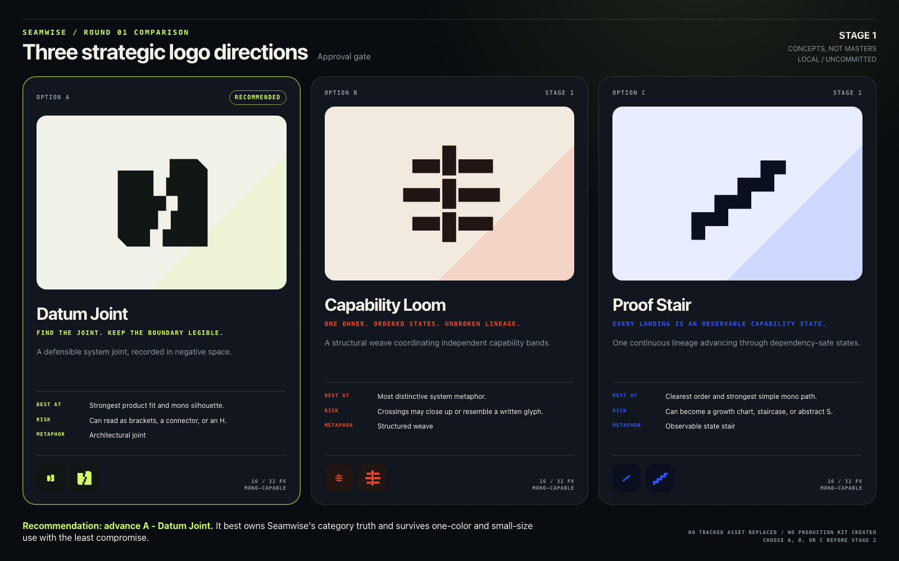
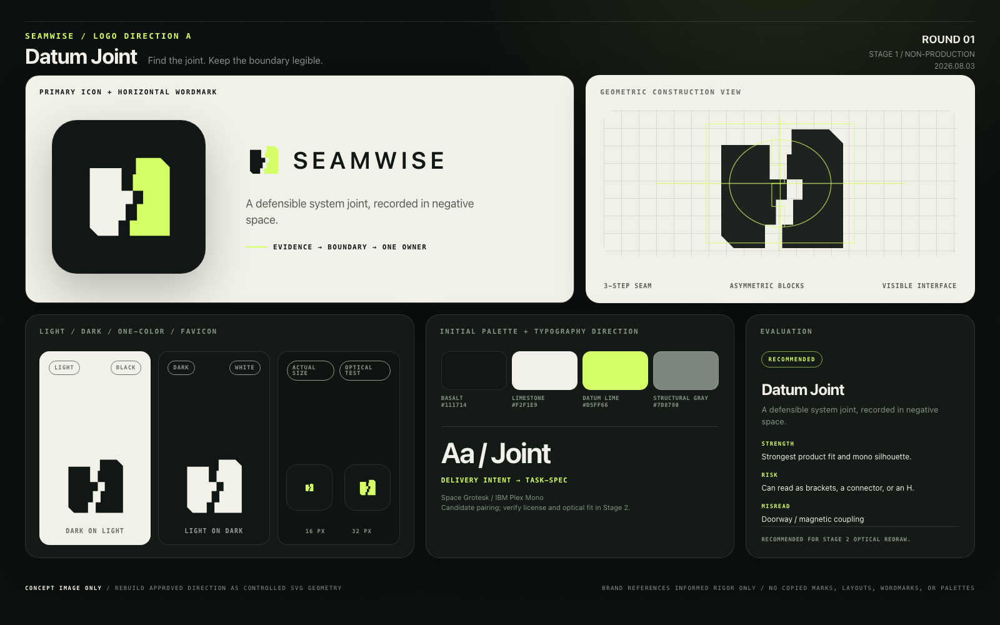
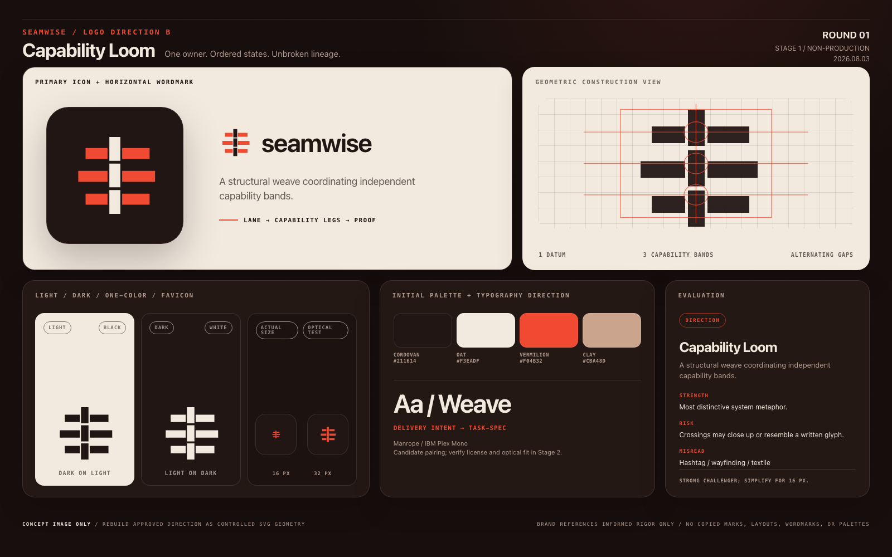
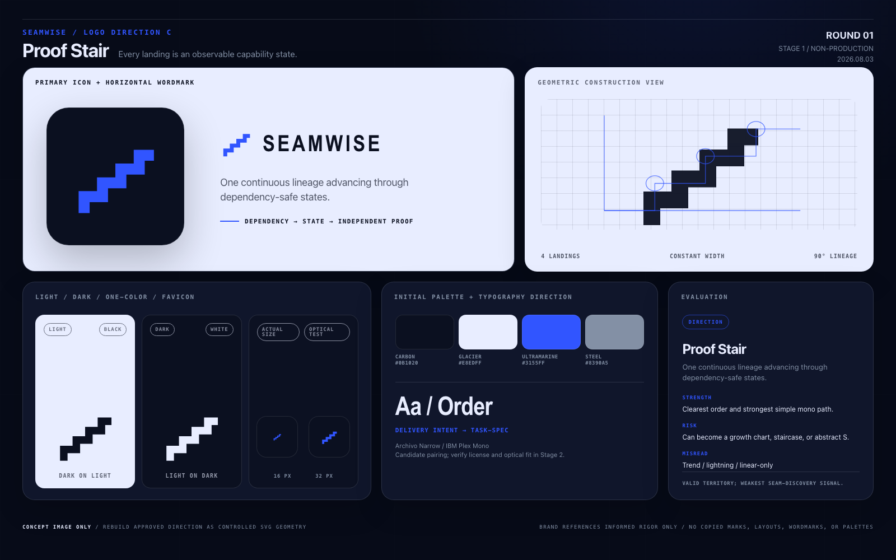

# Seamwise Logo Directions - Round 01

This directory contains Stage 1 identity exploration only. The marks are
AI-assisted raster concept sources placed into controlled evaluation sheets.
They are not production logo masters, approved identity, or evidence of shipped
product behavior.

No existing project asset was replaced. No product code, package, schema, CI,
installer, commit, push, or publication is part of this round.

## Start here

| Direction | Strategic idea | Primary strength | Primary risk |
| --- | --- | --- | --- |
| [A - Datum Joint](option-a-datum-joint.png) | Find and preserve a defensible system joint | Strongest product fit and small-size silhouette | Can be misread as brackets, a connector, or an `H` |
| [B - Capability Loom](option-b-capability-loom.png) | Coordinate owned capability legs without losing lineage | Most distinctive system metaphor | Crossings can close up or resemble a glyph at small sizes |
| [C - Proof Stair](option-c-proof-stair.png) | Progress through dependency-safe, observable states | Clearest sense of order and momentum | Can drift toward a growth chart, stair icon, or abstract `S` |

## Recommendation

Advance **Option A - Datum Joint**.

It is the most direct expression of Seamwise's differentiating action: finding
a real system joint and keeping that boundary legible through decomposition. It
also has the strongest one-color and favicon behavior of the three, and it
evolves the repository's established seam story without copying the existing
opposing-plate silhouette.

The approval should be conditional on a Stage 2 optical redraw that reduces the
remaining `H`/bracket reading, makes the two halves unmistakably complementary,
and tests collision risk before the geometry becomes canonical.

Option B is the strongest challenger if the priority is a more radical break
from the current identity. Option C is strategically valid but less ownable.

## Option A - Datum Joint

### Strategic rationale

Seamwise begins by finding a defensible boundary. Datum Joint turns that act
into the identity: two architectural bodies are independently legible, while a
precise stepped void records the joint between them.

### Core metaphor

An architectural datum plus a stepped joint. The negative space is not damage;
it is the explicit boundary that makes safe coordination possible.

### Product action

The mark expresses evidence-backed separation before task creation. It says
"find the joint, name both sides, preserve the interface" rather than "split
everything."

### Proposed icon

Two offset structural blocks face one another across an asymmetric three-step
seam. Small 45-degree outer cuts keep the form architectural without recreating
the current plate mark.

### Horizontal wordmark

Uppercase `SEAMWISE`, moderate tracking, quiet geometric terminals. The icon
should carry most of the personality; the wordmark should be stable and
unforced.

Candidate type direction: **Space Grotesk** for display/wordmark exploration
and **IBM Plex Mono** for technical labels. Licensing and final wordmark
construction must be verified in Stage 2.

### Color applications

- Light: Basalt body with a Datum Lime counter-signal on Limestone.
- Dark: Limestone and Datum Lime on Basalt.
- The accent identifies the joint; it must not become a generic success state.

Initial palette:

- Basalt `#111714`
- Limestone `#F2F1E9`
- Datum Lime `#D5FF66`
- Structural Gray `#7D8780`

### One-color behavior

The stepped void carries the concept in solid black or solid white. No gradient,
glow, or secondary color is required.

### Favicon behavior

The source remains identifiable at 32 px. At 16 px, the three-step void needs a
purpose-built pixel/optical correction so it does not collapse into a generic
`H`.

### Construction logic

A near-square field is split into two unequal structural blocks. A shared
three-step datum defines equal internal clearances while the outer chamfers
provide orientation.

### Strengths

- Closest to the core category truth.
- Strong mono and reverse behavior.
- Natural continuity with "Find the joints" without repeating the current mark.
- Easy to apply as a compact CLI, app, and documentation symbol.

### Risks and possible misreadings

- `H`, brackets, connector, doorway, or magnetic coupling.
- If the gap becomes too narrow, it reads as breakage rather than a governed
  interface.
- If colored symmetrically, it may feel like a generic construction company.

## Option B - Capability Loom

### Strategic rationale

Seamwise does more than identify boundaries: it gives every accepted seam one
owning lane and sequences observable capability states. Capability Loom makes
coordination, not separation, the central idea.

### Core metaphor

One structural datum interlocks with three capability bands. The controlled
over-under rhythm represents coordination and lineage, not literal textile
craft.

### Product action

The mark shows independently meaningful bands held in one ordered system. It
expresses "one owner, explicit sequence, shared proof chain" without using
nodes, arrows, or a flowchart.

### Proposed icon

A compact vertical datum with three staggered horizontal bands and deliberate
negative-space crossings.

### Horizontal wordmark

Lowercase `seamwise` with a calm, humanist geometric rhythm. The softer
wordmark keeps the modular icon from feeling overly infrastructural.

Candidate type direction: **Manrope** for display/wordmark exploration and
**IBM Plex Mono** for machine evidence. Licensing and final wordmark
construction must be verified in Stage 2.

### Color applications

- Light: Cordovan structure with Vermilion capability bands on Oat.
- Dark: Oat structure with Vermilion bands on Cordovan.
- Hard color divisions may clarify the over-under construction; gradients are
  unnecessary.

Initial palette:

- Cordovan `#211614`
- Oat `#F3EADF`
- Vermilion `#F04B32`
- Clay `#CBA48D`

### One-color behavior

The alternating gaps must communicate the crossing when every band is the same
color. This is the principal feasibility test for Stage 2.

### Favicon behavior

At 32 px, the rhythm remains visible. At 16 px, the crossings need fewer,
wider gaps and a custom small-size master.

### Construction logic

One constant-width vertical module intersects three equal horizontal modules.
Alternating cuts indicate over/under order; endpoint offsets indicate
progression without arrowheads.

### Strengths

- Most differentiated from the current plate identity.
- Expresses swimlanes, capability legs, and preserved lineage.
- Supports a flexible modular pattern system.
- Feels coordinated rather than merely partitioned.

### Risks and possible misreadings

- Hashtag, wayfinding symbol, plus sign, woven craft mark, or unfamiliar written
  glyph.
- Too many gaps will fail at 16 px.
- A multicolor execution could become decorative and lose one-color integrity.

## Option C - Proof Stair

### Strategic rationale

Capability legs are observable states, not activity phases. Proof Stair makes
that disciplined progression the identity: every landing is meaningful, and
the lineage remains unbroken from first state to final proof.

### Core metaphor

A load-bearing stair made from one continuous band with four equal landings.

### Product action

The mark expresses dependency-safe order. The work advances only through
observable states; it does not jump directly from intent to a claim of done.

### Proposed icon

One thick orthogonal band folded into four compact ascending landings with
squared start and end.

### Horizontal wordmark

Uppercase `SEAMWISE` in a condensed technical grotesk with tight but breathable
spacing. The wordmark should feel sequential and precise rather than fast.

Candidate type direction: **Archivo Narrow** for display/wordmark exploration
and **IBM Plex Mono** for technical evidence. Licensing and final wordmark
construction must be verified in Stage 2.

### Color applications

- Light: Ultramarine mark and Carbon wordmark on Glacier.
- Dark: Glacier mark with Ultramarine accents on Carbon.
- Ultramarine is the master accent; success/failure semantics must use separate
  product tokens.

Initial palette:

- Carbon `#0B1020`
- Glacier `#E8EDFF`
- Ultramarine `#3155FF`
- Steel `#8390A5`

### One-color behavior

The continuous path works in black and white without internal detail. Its
simplicity is the main advantage of this direction.

### Favicon behavior

The silhouette remains legible at 16 and 32 px, but the number of landings must
be protected during the SVG redraw so the mark does not become a generic zigzag.

### Construction logic

A constant-width band turns at a fixed 90-degree radius on a four-unit modular
grid. Equal rise and run encode stable state transitions.

### Strengths

- Immediate order and forward progression.
- Excellent one-color reproduction.
- Simple construction and strong motion potential.
- Distinct from network-node and plate metaphors.

### Risks and possible misreadings

- Growth chart, staircase, lightning path, or abstract `S`.
- May overemphasize linearity when the actual task graph can branch.
- Says less about seam discovery and ownership than Options A and B.

## Concept-source provenance

The three source marks under `source/` were generated with the built-in
`imagegen` path on removable chroma-key backgrounds, then locally converted to
transparent PNGs and alpha-checked.

Prompt set:

1. **Datum Joint:** two architectural blocks meeting across an asymmetric,
   stepped negative-space joint; strong one-color silhouette; no letters,
   badges, arrows, or sewing imagery.
2. **Capability Loom:** one structural datum interlocking with three ordered
   capability bands; architectural rather than textile; no nodes or generic
   grid.
3. **Proof Stair:** one continuous band forming four dependency-safe capability
   landings; no arrow, chart axis, lightning bolt, or ordinary `S`.

The presentation sheets use rough, vector-like evaluation redraws of those
sources so typography, color, mono, construction, and small-size behavior can be
compared cleanly. Those redraws are presentation geometry, not approved or
production SVG masters. Neither the source PNGs nor the sheets may be used as
production logo masters.

## Approval gate

Choose **A, B, or C**, or request one narrowly defined refinement round.

After explicit approval, Stage 2 may rebuild only the selected direction as
controlled SVG geometry, correct optical balance and small-size behavior, and
produce the production kit. Until then, `brand-kit-v1/` and
`seamwise-brand-kit-v1.zip` must not be created.
