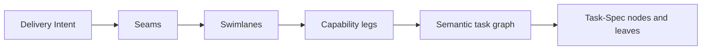

# Seamwise Project

## Project identity

**Repository:** `luanmorenommaciel/seamwise`

**Status:** pre-implementation foundation

**Canonical architecture:** [`seamwise.pdf`](seamwise.pdf)

**Canonical PDF SHA-256:** `cad353a000ee1cffe5c41e56307c4d1ac164641853d21f78cbc90d8c8271e5ee`

This document is the concise, repository-native orientation for Seamwise. The PDF is the authoritative target implementation blueprint. This document explains the project but does not replace or silently amend that blueprint.

## Executive summary

Seamwise is the missing architecture-aware layer between an intended engineering outcome and trustworthy implementation tasks.

Ordinary decomposition commonly produces a flat backlog organized around convenient activities, folders, or team assignments. Individual tasks may look reasonable while the collection loses:

- the architecture that justifies the split;
- ownership and interface boundaries;
- causal and dependency ordering;
- safe parallelism;
- end-to-end integration proof;
- lineage from the intended outcome to every executable task.

Seamwise preserves those properties by lowering work through a typed semantic chain:



The result is a reviewed, lineage-complete Task-Spec DAG that can be consumed by any conformant executor or by Converge.

## Canonical definition

**Seamwise Decomposition is a model-agnostic engineering method and toolchain that transforms Delivery Intent plus system evidence into an architecture-aware, dependency-safe, eval-backed Task-Spec graph.**

Seamwise is not task splitting. It is meaning-preserving work lowering.

## Source and status boundary

The architecture document is a **target implementation blueprint**. It preserves current concepts from Converge 0.1 and Task-Spec format 3 while proposing a standalone Seamwise package and CLI.

The following distinctions are mandatory:

| Claim class | Meaning |
|---|---|
| Current | Verified in an existing source repository, contract, test, or runtime |
| Proposed | Specified by the blueprint but not yet implemented here |
| Derived | Rebuildable projection produced from canonical artifacts |
| External | State owned by another system, such as GitHub, a tracker, or a runtime |

Nothing in the PDF, this document, or an agent conversation is evidence that the target compiler already ships.

## The problem Seamwise solves

A flat task list can hide false boundaries and accidental coupling. For example, decomposing organization-level rate limiting into “schema,” “endpoint,” “tests,” “docs,” and “metrics” organizes activities but does not identify the real system joints.

A Seamwise decomposition instead exposes boundaries such as:

- policy and configuration;
- enforcement;
- metering;
- observability.

Each accepted seam owns a coherent swimlane. Each swimlane progresses through observable capability legs. Each leg compiles into one or more independently provable Task-Specs.

The work becomes smaller without losing the system model that makes the tasks legitimate.

## Five durable concepts

### Delivery Intent

The intended observable outcome, affected actor or system, trigger, scope, constraints, non-goals, and acceptance evidence.

### Seam

A natural system joint with evidence, one coherent responsibility, consumed and produced interfaces, ownership, and an independence claim. A team name, directory, or arbitrary feature slice is not sufficient.

### Swimlane

One coherent stream of delivery aligned to one accepted seam. It has a clear owner, inputs, outputs, non-responsibilities, and explicit dependencies.

### Capability leg

An observable intermediate capability state inside a swimlane. “Design,” “implementation,” “testing,” and “cleanup” are activities, not capability legs.

### Task-Spec

One independently provable executable atom, or a non-runnable composition node. It carries scope, behavior, evals, dependencies, budgets, authority, lifecycle, rollback, and observability.

## Structural invariants

The initial type system is:

```text
1 Delivery Intent
  -> 1..N accepted seams

1 accepted seam
  -> exactly 1 owning swimlane

1 swimlane
  -> 1..N ordered capability legs

1 leg
  -> 1..N task candidates

1 task candidate
  -> exactly 1 Task-Spec node or leaf
```

Additional invariants:

- Avoid nested legs in version one.
- Cross-cutting concerns become constraints, interfaces, or explicit integration tasks rather than duplicate ownership.
- A runnable leaf owns one coherent failure story.
- Sibling tasks are not automatically parallel.
- Parallelism must be justified by dependencies, path contention, and runtime isolation.
- Every Task-Spec inherits its purpose from the leg, coordination from the swimlane, boundary from the seam, and proof from the Task Pack.

## Terrain

Seamwise supports three operating terrains:

### Greenfield

There is little implementation to inherit. Discovery grounds intent in surrounding systems, protocols, data sources, deployment constraints, and explicit assumptions. New paths are declared as proposed creations.

### Brownfield

The live repository and runtime are authoritative. Discovery examines schemas, services, jobs, tests, deployments, interfaces, and operational paths. Proposed seams must reflect real contracts.

### Hybrid

New capability is introduced into an existing environment. Some seams are observed; others are deliberate architecture decisions. The seam map must distinguish the two.

## Four transformations

### 1. `to-seam-map`

Transforms Delivery Intent and evidence into defensible system joints.

It:

1. normalizes the Delivery Intent;
2. classifies the terrain;
3. discovers the relevant system reality;
4. records evidence with source, freshness, confidence, and claim class;
5. generates seam hypotheses;
6. attacks and refutes false boundaries.

It produces the system map, evidence register, accepted and rejected seam records, and open decisions. If a truthful boundary cannot be established, it stops rather than manufacturing one.

### 2. `to-delivery-plan`

Transforms accepted seams into owning swimlanes, ordered capability legs, a steel thread, and a reviewed delivery graph.

It:

- assigns exactly one swimlane to each accepted seam;
- defines interfaces, responsibilities, and non-responsibilities;
- sequences observable capability states;
- identifies the minimum cross-lane steel thread proving early end-to-end value;
- records dependencies and contention;
- subjects the plan to a different-family adversarial review.

Objections must finish as `FIXED`, `ACCEPTED` with an owner and rationale, or `OPEN` with the gate still closed.

### 3. `to-task-graph`

Compiles the reviewed delivery plan into a semantic graph.

It decides:

- which work units must exist;
- which are runnable leaves or composition nodes;
- which prerequisite, parent-child, integration, and contention edges apply;
- what the critical path and ready frontier are;
- which work may execute concurrently;
- how every node traces back to intent, evidence, decisions, seams, lanes, legs, and review.

A task graph cannot be ready if it is cyclic, collision-prone, lineage-incomplete, blocked, or contains an unprovable leaf.

### 4. `to-task-specs`

Materializes every semantic node and leaf into the appropriate Task-Spec shape.

It selects:

- effort: `XS` through `L` for runnable leaves, `XL` or `XXL` for composition nodes;
- profile: `lite`, `standard`, or `full`;
- behavior and eval contracts;
- scope, dependencies, budgets, guardrails, rollback, and observability;
- validation and explicit preflight or sealing mode.

Ordinary compilation must never auto-seal a Task-Spec. Dispatch authority is a separate, explicit operation.

## Product surfaces

The target implementation exposes:

- `seamwise init`
- `seamwise map`
- `seamwise plan`
- `seamwise review`
- `seamwise compile`
- `seamwise prepare`
- `seamwise tasks emit|validate|preflight|seal`
- `seamwise inspect`
- `seamwise graph`
- `seamwise report`
- `seamwise agent-context`

The CLI must be agent-native, parse-stable, provider-neutral, explicit about mutation, and capable of emitting stable tokens, exit codes, and JSON envelopes.

Task-Spec remains the atomic contract and lightweight user mode. Its implementation becomes the embedded Task Pack, with one source for parsing, templates, validation, PRE, POST, HMAC, lifecycle, graph extraction, and conformance tests.

## Artifact authority

The intended workspace distinguishes four authority classes:

| Authority class | Examples | Rule |
|---|---|---|
| Canonical authored truth | intent, decisions, seam records, lane and leg records, Task-Specs | Changed only by the owning transformation and renewed review |
| Derived local state | aggregate YAML, indexes, critical path, graph projections | Rebuildable from canonical sources |
| Append-only evidence | telemetry, lifecycle events, attempts | Corrected by later accounted events |
| External projection | GitHub, tracker, cockpit, HTML report | Reconciled from canonical identity and evidence |

Artifacts authorize. Telemetry observes. A dashboard, model response, or green trace does not overwrite canonical truth.

## Trust model

Seamwise separates four claims:

1. **Instruction integrity:** the reviewed contract and authority-bearing fields have not changed.
2. **Runtime enforcement:** the executor actually enforced filesystem, network, secret, and tool restrictions.
3. **Outcome evidence:** task evals, optional holdouts, path checks, receipts, and lifecycle evidence support acceptance.
4. **Model contribution:** a model researched, proposed, attacked, or authored within a bounded role.

No single green signal proves every claim.

Research and MCP providers supply perishable evidence. Sources must be recorded with URI or path, freshness, and hash when possible. Models and providers are never canonical sources of truth.

## Relationship to Task-Spec and Converge

| System | Begins with | Ends with | Core question |
|---|---|---|---|
| Task-Spec mode | A known bounded job | A valid, sealed, or accepted Task-Spec | What exactly is done? |
| Seamwise | Delivery Intent plus system evidence | A ready Task-Spec DAG | What are the right atoms and order? |
| Converge | An idea, pain, BRD, or high-trust need | A settled, inspectable evidence chain | What should exist, who authorizes it, and did it safely become real? |

Use Task-Spec when the job is known. Use Seamwise when the outcome is known. Use Converge when the entire journey must be governed.

Seamwise understands, structures, decomposes, and specifies. Converge authorizes, executes, proves, settles, and learns.

## Implementation sequence

The blueprint defines six phases:

### Phase 0 - Extract without change

Move the Task Pack into Seamwise while preserving current formats, scripts, tests, tokens, signatures, and entry points. Exit only with byte and behavior parity.

### Phase 1 - Introduce four skills

Implement transformation contracts and artifact schemas with positive and adversarial fixtures.

### Phase 2 - Add CLI profiles

Add the `seamwise` CLI and thin `task-spec` wrapper with stable commands, tokens, JSON, dry-run behavior, and agent context.

### Phase 3 - Add lineage and graph

Implement lineage, OpenTelemetry events, graph projections, and static HTML evidence for one proving deliverable.

### Phase 4 - Add the learning flywheel

Capture, challenge, promote, measure, and retire scoped lessons through reviewed fixtures and benchmarks.

### Phase 5 - Integrate with Converge

Have Converge pin Seamwise and wrap it with owner governance, Bind, Loop, settlement, graph aggregation, and learning without rewriting Seamwise.

The migration rule is: **move first, refactor second**.

## Initial repository state

At this foundation checkpoint, the repository intentionally contains:

```text
.
├── AGENTS.md
├── README.md
└── docs/
    ├── project.md
    └── seamwise.pdf
```

There is no implementation yet. The next decision is whether this project framing accurately captures the canonical blueprint and is sufficient to authorize Phase 0 planning.

## Foundation review

Reviewers should answer:

1. Is `docs/seamwise.pdf` accepted as the canonical target implementation blueprint?
2. Does this orientation preserve the difference between current source truth and proposed architecture?
3. Are the five concepts and structural invariants represented accurately?
4. Are the responsibilities of Task-Spec, Seamwise, and Converge distinct?
5. Is Phase 0 correctly bounded to relocation with behavioral parity rather than redesign?
6. What named decision or source evidence is still required before Phase 0 planning?

Until those questions are resolved, repository outputs remain proposals and no implementation phase is authorized.
