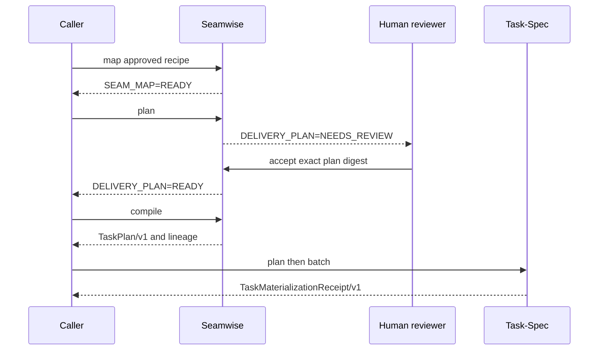

# Seamwise project architecture

## Purpose

Seamwise is an architecture-aware decomposition compiler. It turns one
approved initiative into reviewed execution topology and two portable boundary
artifacts:

```text
Delivery Intent
  → evidence-backed seam
  → one owning swimlane
  → observable capability leg
  → dependency and contention proof
  → reviewed TaskPlan/v1
  → SeamwiseTaskPlanLineage/v1
```

It does not materialize Task-Spec Markdown. That is an explicit coordination
step performed through the independent Task-Spec engine.

## Responsibilities

Seamwise owns:

- delivery intent and local evidence projection;
- seam identification and responsibility assignment;
- one owning swimlane per seam;
- observable capability legs and their independent proof;
- dependency, contention, path, and critical-path analysis;
- digest-bound human review of the delivery plan;
- deterministic projection into `TaskPlan/v1`;
- lineage from every TaskPlan unit to intent, review, seam, lane, and leg.

Seamwise does not own:

- continuous portfolio discovery;
- TaskPlan validation or task materialization;
- Task-Spec Markdown, sealing, authorization, handoff, or acceptance;
- execution-loop scheduling or settlement;
- human-facing multi-format release rendering.

Those responsibilities belong to upstream intent systems, Task-Spec,
Converge, executors, and Brief-Spec respectively.

## Runtime sequence



The `S-->>C` compile response is the repository boundary. Seamwise does not
call the final two Task-Spec messages itself.

## Compile transaction

After verifying the current human review, Seamwise rebuilds the topology and
both output objects from canonical inputs. It writes exactly:

- `seamwise/task-plan.json`;
- `seamwise/task-plan-lineage.json`.

Both files are staged and replaced in one lock-protected transaction. Dry-run
returns the intended paths without writing. Failed topology or review checks
write neither artifact.

The TaskPlan contains tools, done condition, behavior-to-eval traceability,
write surfaces, dependencies, rollback, and observability for every unit. Its
`approved: true` means only that the decomposition passed Seamwise's explicit
human review. It is not Task-Spec dispatch authorization.

The lineage contract binds:

- Seamwise engine version;
- intent ID and digest;
- delivery-plan digest;
- review digest, reviewed plan digest, reviewer, timestamp, and fixture class;
- canonical TaskPlan digest and path;
- every unit ID to intent, seam, swimlane, leg, and source digest.

## Machine contracts

All JSON commands return `SeamwiseCLIResult/v1`. A coordinator discovers the
engine with:

```bash
seamwise --json capabilities
```

The nested `SeamwiseCapabilities/v1` declares supported contracts, the engine
version, relevant commands, and the negative authority facts:

```json
{
  "materializes_tasks": false,
  "dispatch_authority": false
}
```

Converge may negotiate this surface and pass the emitted TaskPlan to Task-Spec.
It must not infer compatibility from terminal prose or file names alone.

## Human authority

Delivery-plan review is Seamwise-owned because decomposition is Seamwise's
responsibility. The review receipt binds reviewer, reason, timestamp, fixture
class, draft digest, and plan digest.

```text
Seamwise plan review      ≠ Task-Spec validation
TaskPlan emission         ≠ task materialization
task materialization      ≠ dispatch authorization
dispatch authorization    ≠ implementation success
evaluation result         ≠ independent acceptance
```

Any edit to the plan, review receipt, intent, or source lineage makes the
projection fail closed.

## Durable artifacts

Seamwise-owned canonical and reviewed inputs:

- `seamwise/intent.md`
- `seamwise/system-map.md`
- `seamwise/evidence.jsonl`
- `seamwise/seam-map.yaml`
- `seamwise/delivery-plan.yaml`
- `seamwise/reviews/delivery-plan-review.json`
- `seamwise/seams/*.md`
- `seamwise/swimlanes/*.md`
- `seamwise/legs/*.md`

Portable boundary outputs:

- `seamwise/task-plan.json`
- `seamwise/task-plan-lineage.json`

Task-Spec-owned outputs such as `tasks/T-*.md` and materialization receipts are
outside Seamwise's managed workspace roots.

## Status, graph, and recovery

`seamwise status` regenerates the expected graph, TaskPlan, and lineage from
the reviewed inputs. If only one output exists, either projection differs, or
review/source evidence is stale, status returns `STATUS=BLOCKED` with a named
diagnostic.

`seamwise graph` derives graph JSON and Mermaid in memory. It is read-only and
does not create another canonical topology file. Repeating `compile` with
unchanged inputs produces identical bytes.

## Security model

- Managed writes are atomic and lock-protected.
- Project paths reject traversal, globs, ambiguous case, collision, and
  symlink escape.
- Coordinated graph and lineage tampering cannot erase reviewed tasks because
  status independently rebuilds the expected projections.
- No Task-Spec executable, credential, signing key, or provider environment is
  consumed by Seamwise runtime code.
- Chat packets and reports explain verified state but cannot transition it.

## Release proof

`make check` is the complete local release boundary. It proves source quality,
schemas, deterministic transformations, tamper rejection, documentation,
package contents, clean installation, host lifecycle, and the emitted
TaskPlan's compatibility with an independently resolved Task-Spec v3 engine.

The canonical PDF is preserved as historical v0.1 target evidence. Current
behavior is established by source, schemas, tests, built packages, and release
evidence.
