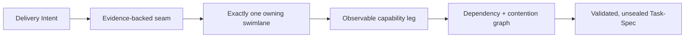

# Seamwise project orientation

## Identity

- Repository: `luanmorenomaciel/seamwise`
- Package and CLI version: `0.1.0` (`v0.1.0-alpha` candidate; not tagged or published)
- Current phase: implemented alpha with executable release gates
- Canonical target blueprint: [`seamwise.pdf`](seamwise.pdf)
- Canonical PDF SHA-256: `cad353a000ee1cffe5c41e56307c4d1ac164641853d21f78cbc90d8c8271e5ee`

Seamwise is an architecture-aware, model-agnostic intent-to-task compiler. It
lowers Delivery Intent plus evidence through defensible seams, one owning
swimlane per seam, observable capability legs, a semantic task graph, and
validated Task-Spec drafts.

## Read order

1. [`../README.md`](../README.md) for installation and the user journey.
2. This orientation for source and authority boundaries.
3. [`seamwise.pdf`](seamwise.pdf) for the canonical target architecture.
4. Accepted records in [`decisions/`](decisions/) for choices the PDF leaves open.
5. `src/`, `schemas/`, and `tests/` for current executable behavior.

## Current versus proposed

| Class | Meaning in this repository |
| --- | --- |
| `current` | Verified source, schema, test, command result, or runtime behavior |
| `proposed` | Authored intent, blueprint target, agent suggestion, or unaccepted design |
| `derived` | Rebuildable projection from canonical authored artifacts |
| `external` | State owned by another repository, provider, host, or service |

The PDF is canonical for the target system; it is not evidence that a feature
ships. For current behavior, executable contracts win. Accepted decisions may
fill an unspecified implementation detail but may not silently amend the PDF.

## Implemented surface

The current package contains:

- four deterministic, fail-closed transformations;
- authored recipe/evidence inputs and compiler-owned Markdown/frontmatter projections with SHA-256 lineage;
- stable tokens, exit codes, and a versioned JSON result envelope;
- explicit delivery-plan review with hash-bound receipts;
- cycle, collision, write-budget, dependency, and tamper detection;
- Task-Spec v3 draft materialization and Task Pack wrappers;
- status, next, prepare, inspect, graph, report, and chat-context UX;
- receipt-owned Codex and Claude Code native-skill installers;
- Codex and Claude plugin manifests that call the same CLI;
- clean-room packaging, installer, proving-case, and release checks.

Ordinary compilation never preflights, seals, dispatches, executes, accepts, or
settles a task. Those authority transitions remain explicit.

## Canonical semantic chain



Non-negotiable invariants:

- one accepted seam has exactly one owning swimlane;
- a capability leg names a capability state, not an activity;
- one runnable leaf owns one coherent, independently provable done-condition;
- sibling position does not imply concurrency;
- evidence, owner, architecture, review, lineage, and proof gaps close the gate;
- telemetry observes but does not authorize;
- model output and retrieved text are proposals, never canonical truth;
- Task-Spec, Seamwise, and Converge retain separate responsibilities.

## Artifact authority

Authority is split deliberately:

```text
authored input       recipe.yaml + cited evidence
human authority      seamwise/reviews/delivery-plan-review.json
compiler projections seamwise/{intent,system-map,seams,swimlanes,legs}/**
task projections     tasks/T-*.md + graph + lineage
dispatch authority   verified Tier-1 seal on a non-fixture Task-Spec
```

Indexes, Mermaid, reports, telemetry, and host packets are derived. A receipt
binds review to an exact plan hash. Changing a source artifact after its gate
invalidates downstream readiness; compiler-owned projections must be rebuilt,
not hand-edited.

## Task Pack boundary

Phase 0 imported the complete tracked `skills/task-spec/` tree from Converge
`v0.1.0`, commit `b585ca792418924182e1c6a87f660a5f8afa07bd`, Git tree
`95dae33bf9c8da852ae50a7b6cfc44176cdaa5c8`.

The import contains 125 files, including the template, parser helpers,
validator, PRE/POST gates, HMAC envelope, lifecycle scripts, schemas, fixtures,
and conformance harness. [`../vendor/task-pack-source.json`](../vendor/task-pack-source.json)
records every file hash and executable mode. Seamwise wraps that subsystem; it
does not rewrite its tokens or gate semantics.

Converge's CLI, task loop, runtime binding, trackers, settlement, and learning
passes were not imported. They remain external responsibilities.

## Host boundary

One shared Agent Skills tree serves all hosts:

- Codex project/user installs use `.agents/skills`.
- Claude Code project/user installs use `.claude/skills`.
- Supported plugin surfaces use the root host manifest.
- Plain chat uses `seamwise agent-context --host chat` and cannot claim local execution.

Marketplace publication, hosted ChatGPT installation, authenticated remote MCP,
and external-service authorization are not part of the current release. Hooks,
when added, may diagnose but may not approve or seal.

## Proving case

[`../examples/rate-limiting/recipe.yaml`](../examples/rate-limiting/recipe.yaml)
compiles the blueprint's canonical steel thread:

```text
policy schema valid
  → effective policy resolved
  → request 101 denied
  → stable reason and matching decision telemetry visible
```

The proving run creates four seams, four owners, four capability legs, a
four-node critical path, complete lineage, and four Task-Spec v3 drafts. The
drafts validate and preflight while remaining `signed_off: false` and
`accepted: false`. The fictional target application is deliberately not
presented as implemented.

## Development and sign-off

```bash
uv sync --extra dev
make check
```

`make check` is the credential-free release boundary. It runs static checks,
schemas, positive and adversarial tests, the full imported Task Pack suite in a
disposable copy, package build, a fresh-environment wheel E2E, installer
transactions, documentation checks, and the unchanged PDF hash check.

Credentialed host probes are separate and explicit:

```bash
seamwise doctor --host all --live
```

Never convert a skipped, unavailable, or externally blocked check into a green
claim. Record the access gap and preserve the smallest reversible next step.
